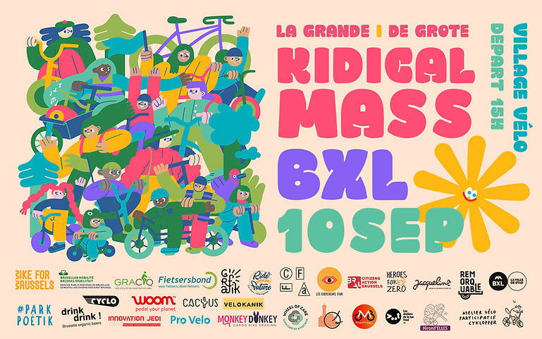
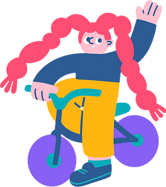
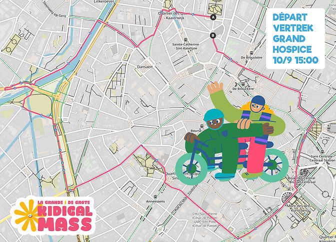
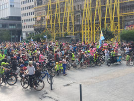
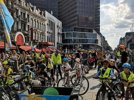
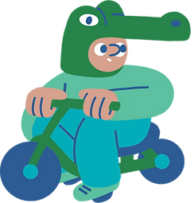
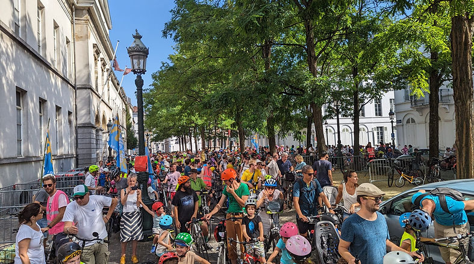
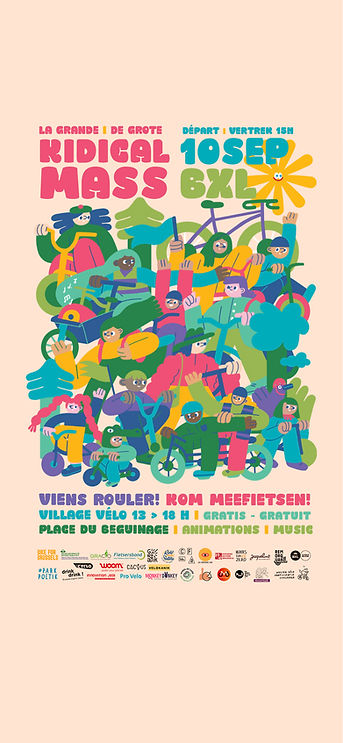
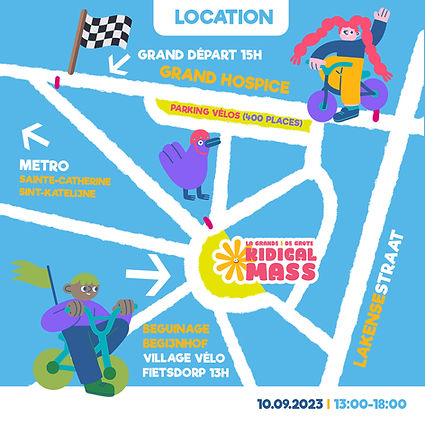
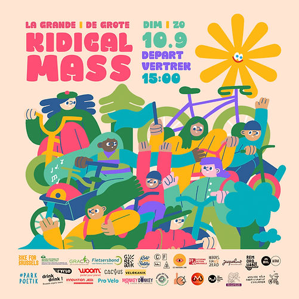

top of page

Skip to Main Content

###### [Cliquer ici pour la page de la Grande Kidical Mass 2024  
Klik hier voor de pagina van de Grote Kidical 2024](https://www.kidicalmass.be/grande-kidical-2024)

###### La Grande Kidical Mass à Bruxelles I Dimanche 10 Septembre 2023

Village Vélo apd 13:00 - Place du Beguinage & Départ à 15h00 en face du Grand Hospice.

\_\_

Ensemble avec les 12 groupes locaux Kidical Mass Brussels et nos partenaires nos organisons une grande Kidical mass dans le centre de Bruxelles le 10 septembre.

Nous nous réunirons à partir de 13 heures dans le village vélo à la place du Beguinage, où les enfants pourront participer à des ateliers et des animations et les parents pourront prendre un verre. Le départ est prévu à 15h00 en face du Grand Hospice (parking vélo). Nous ferons un parcours 5 km dans le centre ville (au rythme des enfants) pour revenir pour un verre, des glaces et un Kididisco !

​

Invitez vos amis et votre famille et célébrez avec nous trois ans de Parades Kidicals à Bruxelles !

[La Grande / De Grote / The Big Kidical Mass @ Brussels](https://www.facebook.com/events/2454635041357959/?__cft__[0]=AZVvYyMkTkWBQluHSgLz-S5luB9NPztjIp4PHQFLMzhkOnC9wmK-Pt977lBYWduLzPqpaQOfh0wth6jcI37Khr7NV_jT0LMriqWPIjVFO0gHfG1oydiuVA0G49amYrLPZ8trc_gJ7KJ7_sAvrIJA_9elaUI_NwF2OhwP7nC3jiukzHo5FS7jNq3AX_Y5l-c5hmM&__tn__=-UK-R)

​

INFO PRATIQUE

​

Le Village Vélo - PLACE DU BEGUINAGE

-   Stand Associatifs : Partenaires vélos 13-15h
    
-   Workshops (sérigraphie, street art, réparation,...) 13-15h
    
-   Animation (Grimage, musique, Live show) 13-15H
    
-   Point eau potable  (coin rue Cirpres)
    
-   Parking vélo @ Grand hospice
    
-   Food Trucks Bikes \- Drink Drink BAR
    

Programme:

13:00 Ouverture Village Vélo: avec stand associatifs, workshop et animations

14:00 Live show : présentation des associations + DJ

15:00 Grand départ - parcours

16:30 Retour au village (glace offerte aux enfants) + suite des animations

18:00 Fin

​

Voici les heures de départ et les lieux pour nos groupes Kidical locaux :

📍 1070 Anderlecht à 14h à Molenwest

📍 1080 Molenbeek à 13h45 à l'Esplanade Tour & Taxis 

📍 1081 Koekelberg + 1082 Sint-Agatha-Berchem + 1083 Ganshoren à 13h30 à Simonis 

📍 1090 Jette à 13h30 à Gare de Jette et à 13h45 à Belgica 

📍 1200 Woluwe-Saint-Lambert + 1150 Woluwe-Saint-Pierre à 13h au square Meudon

📍 1190 Forest avec le Cuistax Parc Poetik

Mais vous pouvez aussi venir directement au village vélo ! Animations uniquement entre 13 et 15 heures

​

[Formulaire Bénévoles - Accompagnateurs (gilets roses):](https://docs.google.com/forms/d/e/1FAIpQLSfATMIKk3w8Zfa8KTEFCeXz64c-I3Ckzgjj9v2RdCEwpBF8Ow/viewform?fbclid=IwAR2e8TXzxDkb3Q7bMFTyraLPBUxrcQhuZGHvtHNSXLJWXFmE0_zvKoq40J8)

[Inscription : https://docs.google.com/.../1FAIpQLSfATMIKk3w8Zf.../viewform](https://docs.google.com/forms/d/e/1FAIpQLSfATMIKk3w8Zfa8KTEFCeXz64c-I3Ckzgjj9v2RdCEwpBF8Ow/viewform?fbclid=IwAR2e8TXzxDkb3Q7bMFTyraLPBUxrcQhuZGHvtHNSXLJWXFmE0_zvKoq40J8)

​

Matériel de communication à partager (affiche, banner, story, post):

[https://drive.google.com/drive/folders/1Z60laXgQ1AENkOaJDRbVwcQd9x4l-KDJ?usp=sharing](https://drive.google.com/drive/folders/1Z60laXgQ1AENkOaJDRbVwcQd9x4l-KDJ?usp=sharing) 

​

[Facebook event](https://www.facebook.com/events/2454635041357959)

[Our Instagram](http://www.instagram.com/kidicalmass.brussels)

[Our Twitter](https://twitter.com/KidicalMassBru?t=2L7cJpGtvyy8Pi1lxFj9fQ&s=08)

Link Parcours : [https://www.komoot.com/tour/1287846826](https://www.komoot.com/tour/1287846826)

###### De Grote Kidical Mass van Brussel I Zondag 10 September 2023

Fietsdorp vanaf 13:00 (Begijnhofplein) & Vertrek om 15h00 aan de Grand Hospice.

Samen met de 12 lokale Kidical groepen, organiseert Kidical Mass Brussels en haar partners de Grote Kidical Mass van Brussel op zondag 10 september. We verzamelen vanaf 13:00 in ons fietsdorp aan het Begijnhof, waar de kinderen kunnen deelnemen aan workshops en animaties en ouders iets kunnen drinken. Het vertrek is gepland om 15:00 aan de Grand Hospice (fietsparking). We leggen een parcours van 5 km af in het centrum van de stad (op kindertempo) om terug samen te komen voor een drink, ijsje en een kididisco!

Het fietsdorp - BEGIJNHOFPLEIN 

-   Standjes (fiets)verenigingen : Fiets partners 13-15u
    
-   Workshops (zeefdrukken, street art, ...) 13-15u
    
-   Animatie (schminken, muziek, liveshow) 13-15u
    
-   Punt voor drinkbaar water (hoek met cipres straat)
    
-   Fietsenstalling aan Grand Hospice
    
-   Foodtrucks
    
-   Drankstand (Drink Drink)
    

​

Programma:

13:00 Opening van het Fietsdorp: workshops en animaties

14:00 Live show: presentatie van de verenigingen, kidical groepen + DJ

15:00 Vertrek parade - parcours

16:30 Terug in het fietsdorp (gratis ijs voor kinderen) 

18:00 Einde van het evenement

​

Hier zijn de vertrektijden en locaties voor onze lokale Kidical-groepen:

📍 1070 Anderlecht om 14h aan MolenWest

📍 1080 Molenbeek om 13.45 uur bij Esplanade Tour & Taxis 

📍 1081 Koekelberg + 1082 Sint-Agatha-Berchem + 1083 Ganshoren om 13.30 uur bij Simonis

📍 1090 Jette om 13h30 aan het station van Jette en om 13h45 aan Belgica  

📍 1200 Sint-Lambrechts-Woluwe + 1150 Sint-Pieters-Woluwe om 13.00 uur bij Square Meudon

📍 1190 Vorst met Cuistax Parc Poetik

Maar je kan ook gewoon rechtstreeks naar het fietsdorp komen! Animaties enkel tussen 13-15u

Nodig vrienden en familie uit en vier met onze drie jaar Kidical Mass parades in Brussel ! 

[Facebook event : La Grande / De Grote / The Big Kidical Mass @ Brussels](https://www.facebook.com/events/2454635041357959/?__cft__[0]=AZVvYyMkTkWBQluHSgLz-S5luB9NPztjIp4PHQFLMzhkOnC9wmK-Pt977lBYWduLzPqpaQOfh0wth6jcI37Khr7NV_jT0LMriqWPIjVFO0gHfG1oydiuVA0G49amYrLPZ8trc_gJ7KJ7_sAvrIJA_9elaUI_NwF2OhwP7nC3jiukzHo5FS7jNq3AX_Y5l-c5hmM&__tn__=-UK-R)

​

[Formulier vrijwilligers/begeleiders op de fiets (gilets roses):](https://docs.google.com/forms/d/e/1FAIpQLSfATMIKk3w8Zfa8KTEFCeXz64c-I3Ckzgjj9v2RdCEwpBF8Ow/viewform?fbclid=IwAR2e8TXzxDkb3Q7bMFTyraLPBUxrcQhuZGHvtHNSXLJWXFmE0_zvKoq40J8)

[https://docs.google.com/forms/d/e/1FAIpQLSfATMIKk3w8Zfa8KTEFCeXz64c-I3Ckzgjj9v2RdCEwpBF8Ow/viewform?fbclid=IwAR2e8TXzxDkb3Q7bMFTyraLPBUxrcQhuZGHvtHNSXLJWXFmE0\_zvKoq40J8](https://docs.google.com/forms/d/e/1FAIpQLSfATMIKk3w8Zfa8KTEFCeXz64c-I3Ckzgjj9v2RdCEwpBF8Ow/viewform?fbclid=IwAR2e8TXzxDkb3Q7bMFTyraLPBUxrcQhuZGHvtHNSXLJWXFmE0_zvKoq40J8)

​

Matériel de communication à partager (affiche, banner, story, post):

[https://drive.google.com/drive/folders/1Z60laXgQ1AENkOaJDRbVwcQd9x4l-KDJ?usp=sharing](https://drive.google.com/drive/folders/1Z60laXgQ1AENkOaJDRbVwcQd9x4l-KDJ?usp=sharing) 

​

###### Materiel de communication Communicatiemateriaal 

bottom of page
