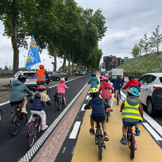
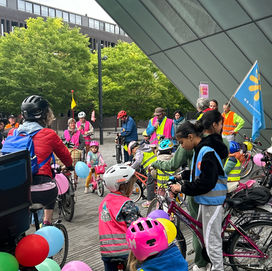

top of page

Skip to Main Content

###### Kidical Mass 7000 à MONS

La Kidical Mass est une parade cycliste festive pour enfants, pour inciter davantage d’enfants (et de parents) à se déplacer à vélo. Nous pédalons au rythme des enfants et respectons le code de la route. La Kidical Mass est le moyen idéal de découvrir la ville et de se faire des nouveaux potes ! Le parcours est défini afin que tout le monde puisse se sentir à l’aise, les petits comme les grands.

Kidical Mass à Mons le :

-   Dimanche   7 décembre 2025 - 13h30
    
-   Dimanche   15  mars 2026 - 13h30
    
-   Dimanche   17 mai  2026 - 13h30
    

Infos pratiques

-   Départ : Du théâtre le Manège  (Rue des Trois Boudins ) 
    
-   Parcours de max 5 - 7 km
    
-   Tous âges, tous niveaux
    
-   Gratuit I Durée max. 1 heure  
    
-   Musique en cours de route 
    
-   Les enfants doivent être accompagnés d’un adulte
    

Suivez-nous:  [kidicalmass.mons.bike](http://kidicalmass.mons.bike)

[https://www.facebook.com/monspointbike](https://www.facebook.com/monspointbike)

Infos sur le vélo à Mons : [www.mons.bike](http://www.mons.bike) 

Contactez-nous: 

[kidicalmass@mons.bike](mailto:kidicalmass@mons.bike)

[bike@kidicalmass.be](mailto:bike@kidicalmass.be)

Partenaires/soutiens: 

[Kidical Mass Belgium](https://www.kidicalmass.be), [Avello Mons](https://avello.org/mons/), [Tata Bicyclette](https://avello.org/tata-bicyclette-mons/), [Bike Repair Social Club](https://avello.org/bike-repair-social-club-mons/), [MARS](https://surmars.be/) (Mons Art de la Scène), [Ville de Mons](https://www.mons.be/fr) & citoyens

### Historique

La Kidical Mass de Mons a débuté en 2025 avec trois éditions organisées durant l’année. Grâce à de précieux partenaires et au soutien de [la coordination Kidical Mass](https://www.kidicalmass.be/organisation), l’équipe organisatrice, composée de Violette, Babas, Sébastien et Thibault, a pu mettre sur pied de magnifiques parades à vélo. La première édition a rassemblé près de 120 participant·es et a eu l’honneur de compter la présence de l'Echevine de la Mobilité, en soutien à ce beau projet.

Au départ du cortège, chaque enfant reçoit un ticket de tombola gagnant à tous les coups. Chacun est toujours reçu avec de jolies surprises à l'arrivée: un accueil chaleureux dans le hall du théâtre le Manège, boissons et collations au bar, coins cocoon et créatifs, petits cadeaux offerts par nos partenaires, et la possibilité d'assister à un spectacle programmé par [MARS](https://surmars.be/) dans le cadre des Dimanches en Famille.

Mons est l'écrin d'initiatives citoyennes engagées telles que le [Bike Repair Social Club](https://avello.org/bike-repair-social-club-mons/), [Tata Bicyclette](https://www.tatabicyclette.be/mons/), [Tous à vélo](https://tousavelo.wixsite.com/tousavelo) ou encore la [Masse Critique](https://www.facebook.com/criticalmassmons). Avec la locale [Avello Mons](https://avello.org/mons/), ces projets sont autant de soutiens au projet Kidical Mass, qui participe joyeusement de ce superbe réseau solidaire ouvert à tou·te·s.

Aftermovie : [https://www.instagram.com/share/\_taisnp\_h](https://www.instagram.com/share/_taisnp_h) 

​

[DH : La premiere Kidical Mass à Mons](https://www.dhnet.be/regions/mons/2025/05/12/une-premiere-kidical-mass-organisee-a-mons-cest-loccasion-de-montrer-que-les-enfants-ont-aussi-leur-place-sur-la-route-T6VVPFQ7EJDJ7NU765P7XZ6DDM/)

​

### Downloads

Retrouvez ici le matériel de communication à télécharger: 

-   Flyer A5 - 2026
    
-   Flyer A5 - Général
    
-   Affiche A4
    

bottom of page
