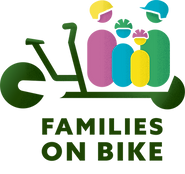
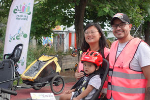
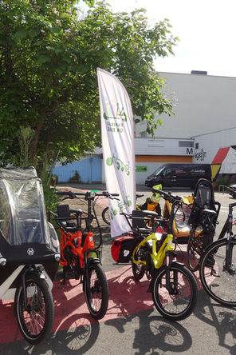
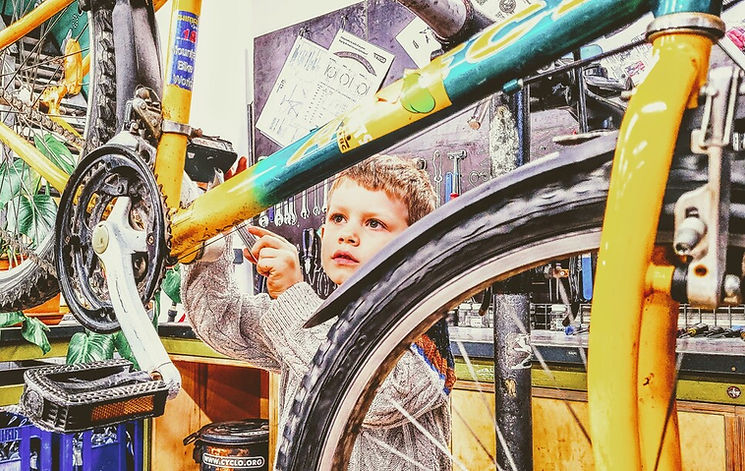
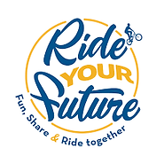
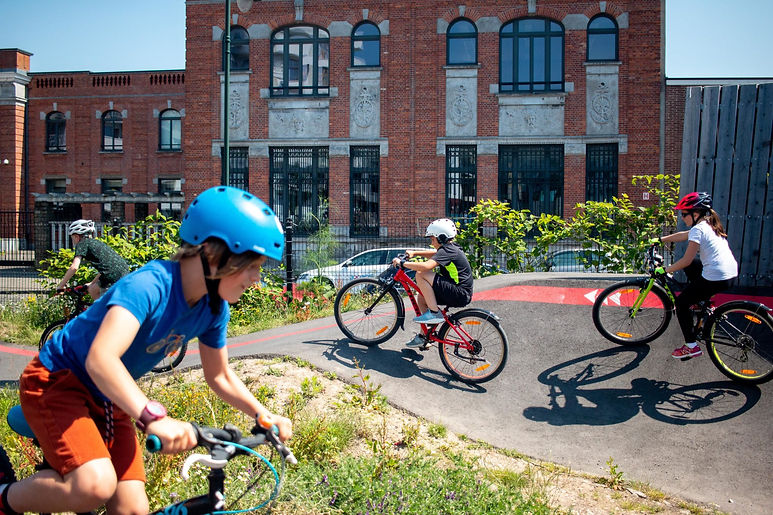

top of page

Skip to Main Content

###### Activités vélo à Bruxelles pour enfants et parents  
Fietsactiviteiten in Brussel voor ouders en kinderen

« Families on Bike » - Provelo

​

FR  Votre famille est-elle prête à se déplacer à vélo ? Venez avec vos enfants tester une large gamme de vélo et trouver la formule qui vous convient ! Vous n’êtes pas encore à l’aise à vélo ? Inscrivez-vous à une formation adaptée à votre niveau.

​

Families on Bike est un programme d’accompagnement gratuit des familles bruxelloises. Nos activités se concentrent autour du Circularium à Anderlecht et dans quartier apaisé ParviS, à cheval sur les communes de Saint-Gilles et Forest.

​\_\_

NL  Is jouw gezin klaar om met de fiets op pad te gaan? Kom samen met je kinderen een hele reeks fietsen testen en vind de formule die bij jullie past! Voel je je nog niet op je gemak op een fiets? Schrijf je in voor een cursus aangepast aan jouw niveau.

​

Families on Bike is een gratis ondersteuningsprogramma voor gezinnen in Brussel.Onze activiteiten concentreren zich rond het Circularium in Anderlecht en in de verkeersluwe wijk VoorpleinEN, die de gemeenten Sint-Gillis en Vorst omringt.

​

Au programme, un panel de formations et d’activités ultra complet :

-   [Pour que votre enfant / ado apprennent à rouler à vélo](https://www.provelo.org/families-on-bike-debutants/) ;
    
-   [Pour apprendre à rouler avec son enfant dans la circulation](https://www.provelo.org/families-on-bike-parents-enfants/) ;
    
-   [Pour prendre confiance en circulation en transportant son enfant](https://www.provelo.org/families-on-bike-parents-enfants/) ;
    
-   [Pour apprendre à créer ses itinéraires sécurisés](https://www.provelo.org/events/families-on-bike-workshop-je-cree-mon-itineraire-ik-maak-mijn-reisplein/) ;
    
-   [Pour passer un super moment de balade en famille](https://www.provelo.org/events/families-on-bike-balade-familiale-a-anderlecht-gezinsfietstocht-in-anderlecht/).
    

CTA : Je me lance !

DÉCOUVERTE pour ADULTE & ENFANT (8+) par Cyclo

  
Avec cette formule vous passez un moment à la fois pédagogique et ludique et vous découvrez les joies de la mécanique ensemble ! Pour adulte et enfant (à partir de 8 ans) en duo. L’enfant apprend à son rythme tout en s'amusant et en acquérant de nouvelles connaissances. L’adulte participe activement autant dans les apprentissages que dans le maniement des outils.

Découverte de son vélo

-   Jeu ludique pour découvrir son vélo et ses composants.
    
-   Chacun son ergonomie : la mise en selle, le guidon et les pédales.
    

Prendre soin de son vélo

-   Prendre soin de son vélo au quotidien, repérer l’usure et les dangers.
    
-   Challenge ludique pour apprendre à réparer une crevaison.
    

​

[Plus d'info : www.cyclo.org/coursduo](http://www.cyclo.org/coursduo)

​

​

LEREN IN DUO VOOR VOLWASSENEN EN KINDEREN door Cyclo

​

Ontdek samen het plezier van fietsmechaniek! Met deze formule voor duo's van een volwassene een kind (vanaf 8 jaar) beleef je een leuk en leerzaam moment met z'n tweeën. Het kind leert op het eigen tempo en op een ludieke manier. De volwassene neemt actief deel aan het leerproces en aan het hanteren van het gereedschap.

​

KEN JE FIETS!

-   We spelen een leuk spel waarbij jullie de (onderdelen van de) fiets leren kennen.
    
-   Samen overlopen we de ergonomie van het zadel, het stuur en de pedalen.
    

​

ZORG DRAGEN VOOR JE FIETS

-   Het dagelijks onderhoud van je fiets en het opsporen van slijtage en gevaren.
    
-   Uitdaging; Hoe repareer je een lekke band?!
    

​

Vergeet zeker jullie fietsen niet, we nemen ze grondig onder de loep. Er is helaas geen tijd voorzien voor het uitvoeren van een herstelling.

  
(Momenteel is deze cursus enkel beschikbaar [in het Frans](https://www.cyclo.org/fr/services/cours-de-mecanique-velo#adulte-enfant-decouvrir-ensemble-la-mecanique-velo).)

[https://www.cyclo.org/nl/diensten/lesmodules/leren-in-duo-voor-volwassenen-en-kinderen](https://www.cyclo.org/nl/diensten/lesmodules/leren-in-duo-voor-volwassenen-en-kinderen)

​

###### Ride Your Future - BXL Pump Park

​

FR - Le Pumptrack, c’est l’outil idéal pour renforcer sa coordination à vélo. En apprenant à « pomper » sur les bosses, les enfants et les adultes améliorent leur équilibre tout en s’amusant !

Ride Your Future gère et anime une piste de 110m de long et un Kids track pour les plus petits situés au Pump Park à Laeken.

​

Bosses et virages relevés se succèdent à un rythme adapté à tous, du débutant au rider pro grâce à ce design unique. Tel le surf, c’est l’attraction pour toutes celles et ceux qui aiment le flow, les sports urbains et les jeux de plein air.

​

Ride your future propose un accueil, une guinguette, du prêt de matériel et des initiations au pump track dans le seul Pump Park de Bruxelles.

Vous souhaitez vous inscrire à une initiation au Pumptrack seul ou en groupe ou vous inscrire aux cours de notre club ? Meer info : [https://rideyourfuture.org/bxl-pump-park/](https://rideyourfuture.org/bxl-pump-park/)

\_\_

​

NL - Een pumptrack is het ideale middel om de coördinatie op de fiets te versterken. Door te leren 'pompen' over de hobbels verbeteren kinderen en volwassenen hun evenwicht terwijl ze plezier hebben!

Ride Your Future beheert en animeert het Pump Park in Laken: een 110 m lange piste en een Kids track voor de kleintjes.

​

Dankzij het unieke ontwerp van hobbels en bochten die elkaar ritmisch opvolgen is het parcours geschikt voor iedereen, van beginner tot prof. Net als surfen trekt het iedereen aan die van flow, urban sports en buitenspelen houdt.

​

Ride your future zorgt er voor het onthaal, de guinguette, het uitlenen van materiaal en het geven van initiaties in het enige Pump Park in Brussel.

​

Wil je je alleen of met een groep deelnemen aan een initiatie Pumptrack? Of wil je elke week trainen en deel uitmaken van onze club? Meer info : [https://rideyourfuture.org/nl/bxl-pump-park/](https://rideyourfuture.org/nl/bxl-pump-park/) 

​​

bottom of page
