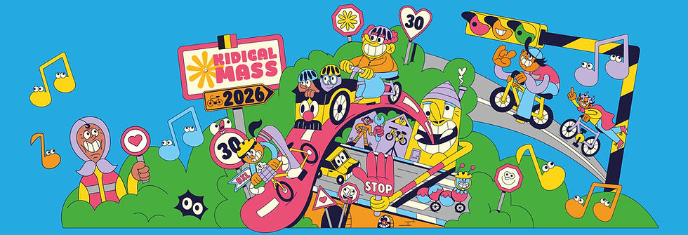
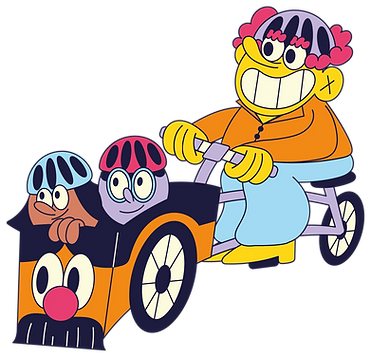
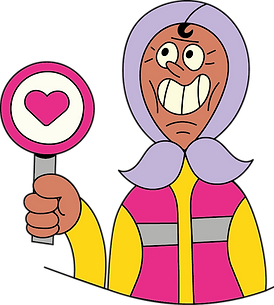
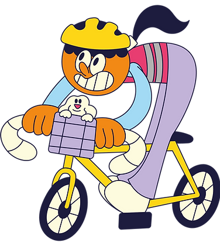
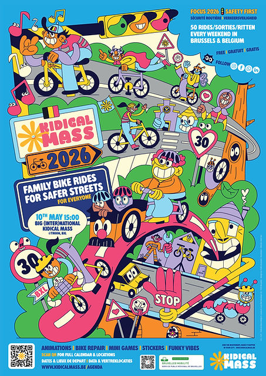

top of page

Skip to Main Content

Kidical Mass Belgium 2026​

Calendar I Calendrier I Kalender  
All rides - toutes les parades - alle fietstochten

More kidicals in Belgium soon (Gent/Antwerp/Leuven/ Charleroi/Namur... work in progress)

Click on the event for all details or find all published [facebook events here](https://www.facebook.com/Kidicalmass.brussels/events)

Heure de départ & Lieux dans le liens/ Vertreklocatie en datum in de link

###### MARCH - MARS - MAART  
07/03  [MEETUP Lancement de Saison @ Growfunding](https://www.facebook.com/events/1439377627577361)  
15/03  [Kidical Mass](https://www.facebook.com/events/1669046660645535) [Mons 13:30](https://www.facebook.com/events/825764460241408) (Wallonie - Wallonië)  
[22/03](https://www.facebook.com/events/1406295344608125)  [Kidical Mass](https://www.facebook.com/events/1406295344608125) [Woluwe-Saint-Pierre & Woluwe-Saint-Lambert / ​Woluwe-Sint-Pieters & Woluwe-Sint-Lambrechts](https://www.facebook.com/events/1406295344608125)  
22/03  [Kidical Mass](https://www.facebook.com/events/1669046660645535) [Schaerbeek - Schaarbeek](https://www.facebook.com/events/1471027811286025)  
26/03  [Verkeersveiligheid Congres @ Mechelen](https://www.congresverkeeropschool.be)  
29/03  [Kidical Mass](https://www.facebook.com/events/1669046660645535) [Forest – Vorst](https://www.facebook.com/events/2370947766758362)  
29/03  [Kidical Mass](https://www.facebook.com/events/1669046660645535) [Watermael-Boitsfort - Watermaal Bosvoorde & Auderghem - Oudergem](https://www.facebook.com/events/1407799980502314)

###### APRIL - AVRIL - APRIL  
19/4  Kidical Mass Evere – Haren - 14:00 Esplanade Cimetière Bruxelles (Evere) [link event](https://www.facebook.com/events/1669046660645535)  
19/4  Kidical Mass Ixelles - Elsene - 15:00 Bois de la Cambre (Av Louise/Diane)  [link event](https://www.facebook.com/events/1492169659181055)  
26/4  Kidical Mass Forest - Vorst  
26/4  Kidical Mass Woluwe-Saint-Pierre – Woluwe-Saint-Lambert

###### MAY - MAI - MEI  
03/05  [Kidical Mass Neder-Over-Heembeek](https://www.facebook.com/events/25948646138169204)   
10/05  [GRANDE GROTE Kidical Mass (Inter)Nationa](https://www.facebook.com/events/1432710188502103)l 15H/U Place Troon  
17/05  Kidical Mass Mons (Wallonie)  
24/05  [Kidical Mass](https://www.facebook.com/events/1669046660645535) Woluwe-Saint-Pierre & Woluwe-Saint-Lambert / ​  
Woluwe-Sint-Pieters & Woluwe-Sint-Lambrechts  
24/05  [Kidical Mass Bruxelles Ville - Brussel Stad](https://www.facebook.com/events/2164891137249028)  
31/05  [Kidical Mass](https://www.facebook.com/events/1669046660645535) Namur - Namen (Wallonie)  
31/05  [Kidical Mass](https://www.facebook.com/events/1669046660645535) Schaerbeek - Schaarbeek  
31/05  [Kidical Mass](https://www.facebook.com/events/1669046660645535) Watermael-Boitsfort - Watermaal Bosvoorde & Auderghem - Oudergem

###### JUNE - JUIN - JUNI  
07/06  [Kidical Mass](https://www.facebook.com/events/1669046660645535) Forest - Vorst  
07/06  [Kidical Mass](https://www.facebook.com/events/1669046660645535) Etterbeek  
14/06  [Kidical Mass](https://www.facebook.com/events/1669046660645535) Laeken - Laken & BXL TOUR  
14/06  [Kidical Mass](https://www.facebook.com/events/1669046660645535) Koekelberg / Berchem / Ganshoren  
21/06  [Kidical Mass Uccle / Ukkel](https://www.facebook.com/events/1669046660645535)  
21/06  [Kidical Mass](https://www.facebook.com/events/1669046660645535) Watermael-Boitsfort - Watermaal Bosvoorde  
& Auderghem - Oudergem  
28/06  [Kidical Mass](https://www.facebook.com/events/1669046660645535) Schaerbeek - Schaarbeek  
28/06  [Kidical Mass](https://www.facebook.com/events/1669046660645535) Woluwe-Saint-Pierre  Woluwe-Saint-Lambert / ​  
Woluwe-Sint-Pieters & Woluwe-Sint-Lambrechts  
  
(Summerbreak Gilets roses) 

###### AUGUST - AOÛT - AUGUSTUS  
30/08  [Kidical Mass](https://www.facebook.com/events/1669046660645535) Schaerbeek - Schaarbeek  
30/08  [Kidical Mass](https://www.facebook.com/events/1669046660645535) Watermael-Boitsfort - Watermaal Bosvoorde  
& Auderghem - Oudergem

###### SEPTEMBER - SEPTEMBRE - SEPTEMBER  
06/09  [Kidical Mass](https://www.facebook.com/events/1669046660645535) Jette - Jette  
06/09  [Kidical Mass](https://www.facebook.com/events/1669046660645535) Uccle - Ukkel  
13/09  [Kidical Mass](https://www.facebook.com/events/1669046660645535) Bruxelles Ville - Brussel Stad  
13/09  [Kidical Mass](https://www.facebook.com/events/1669046660645535) Forest - Vorst  
20/09  Journée Sans Voitures - Autoloze zondag (no kidicals)  
27/09  [Kidical Mass](https://www.facebook.com/events/1669046660645535) Schaerbeek Schaarbeek & Evere / Haren  
27/09  [Kidical Mass](https://www.facebook.com/events/1669046660645535) Woluwe-Saint-Pierre  Woluwe-Saint-Lambert / ​  
Woluwe-Sint-Pieters & Woluwe-Sint-Lambrechts

###### OCTOBER - OCTOBRE - OKTOBER  
04/10  [Kidical Mass](https://www.facebook.com/events/1669046660645535) Anderlecht - Anderlecht  
04/10  [Kidical Mass](https://www.facebook.com/events/1669046660645535) Watermael-Boitsfort Auderghem / Watermaal-Bosvoorde  
11/10  [Kidical Mass](https://www.facebook.com/events/1669046660645535) Koekelberg / Berchem / Ganshoren  
17/10  Bright light parade - Parade des lumières - Lichtparade  
25/10  [Kidical Mass](https://www.facebook.com/events/1669046660645535) Woluwe-Saint-Pierre  Woluwe-Saint-Lambert /  
Woluwe-Sint-Pieters & Woluwe-Sint-Lambrechts  
31/10  [Kidical Mass](https://www.facebook.com/events/1669046660645535) Schaerbeek Schaarbeek  SPOOKY EDITION

###### NOVEMBER - NOVEMBRE - NOVEMBER  
08/11  [Kidical Mass](https://www.facebook.com/events/1669046660645535) Forest - Vorst  
11/11  [Kidical Mass](https://www.facebook.com/events/1669046660645535) Watermael-Boitsfort - Watermaal Bosvoorde ​& Auderghem - Oudergem  
15/11  Fête fin de saison - Einde seizoens feest  
  
(Winterbreak - Repos d'hiver - Winterrust)

[Volunteer !](https://www.kidicalmass.be/volunteer)

[Newsletter](https://docs.google.com/forms/d/e/1FAIpQLSdB_MfyjqEMhIrvkKQZTm5ZLcZWo2Ww7RkJfqieIQV4OFwxcA/viewform?pli=1)

-   
-   
-   
-   

Our calendar is a living thing! It’s a work in progress and will be updated regularly with new events and bike rides.  
So keep an eye out, stay tuned, and don’t miss a ride 🚲

  
Notre calendrier est bien vivant ! Il est en constante évolution et sera mis à jour régulièrement avec de nouveaux événements et balades à vélo. Restez à l’affût, ne ratez rien 🚲 

  
Onze kalender leeft!  Hij is nog in volle ontwikkeling en wordt regelmatig aangevuld met nieuwe events en fietstochten. Blijf dus kijken, blijf nieuwsgierig 🚲

Want a poster A2/A3 or Flyers ? 

Mail us at [bike@kidicalmass.be](mailto:bike@kidicalmass.be)

bottom of page
