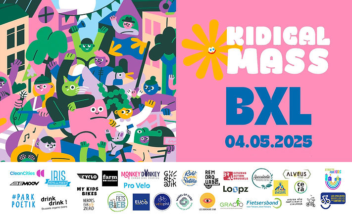
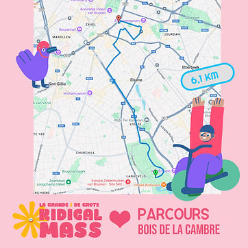
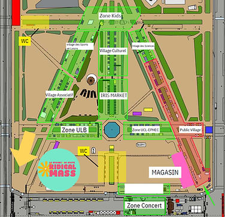
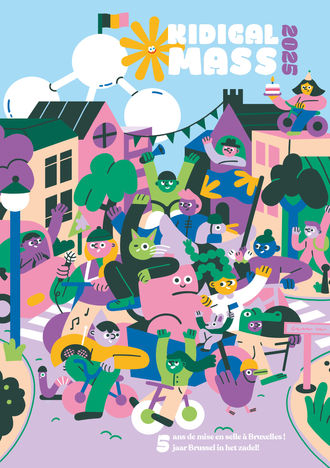

top of page

Skip to Main Content

###### 🎉 La Grande Kidical Mass de Bruxelles

###### Dimanche 4 mai à 14h30 🎉

Cette année, la Kidical Mass de Bruxelles fête ses 5 ans ! Rejoignez-nous en famille le dimanche 4 mai pour célébrer ensemble un demi-décennie de parades joyeuses, engagées et hautes en couleur à travers la capitale.

Depuis 2020, plus de 150 parades ont été organisées pour promouvoir une ville pensée pour les enfants et les cyclistes. Et cette édition s’annonce plus festive que jamais ! Avec le soutien de nombreuses organisations partenaires, la Grande Kidical Mass 2025 sera remplie de surprises, d’animations et de moments inoubliables tout au long du parcours.

​

🌼 Cette année, nous avons l’honneur d’être invités à la fête de l’Iris ! ([Event facebook](https://www.facebook.com/events/952627437084807))  
Retrouvez-nous à notre stand dans le Parc Royal, où vous attendront une animation ludique et un goûter gourmand pour petits et grands, afin de souffler ensemble nos 5 bougies 🎂

​

###### 📍 Infos pratiques :​

-   Rendez-vous à 14h30 au kiosque [Woodpecker dans le Bois de la Cambre](https://g.co/kgs/rUjF2xn)
    
-   Départ pour une balade familiale de 6 km à vélo à travers la ville. [Parcours ici](https://www.google.com/maps/d/u/0/viewer?mid=1UVfOYSr63FYAf2XQvNtCy3Q5RA560Is&ll=50.82366506365359%2C4.3709805000000035&z=13). 
    
-   Arrivée au Parc Royal, pour un moment festif au stand Kidical
    

​

PROGRAMME  
🔹14:30 Grand Rassemblement (Kiosk Woodpecker/Bois de La Cambre)  
🔹14:45 Speech & consignes de sécurité  
🔹15:00 Grand départ + Animations\*  
🔹16:00 Arrivée & Animations\* (Parc Royale)

🔹18:00 Fin des festivités

​

Stand Kidical Mass @ Village Fête de l'Iris (Parc Royale) : Atelier 'Pimp my shirt' 12-18h

​  
\*ANIMATIONS  
🔧 Check vélo & Grimage   
🎧 3 DJs vélos + music en live pendant la parade  
🎉 Char licorne vélo (Alves), cuistax (Park Poetik)   
🎉 Foodtrucks vélo (welkom!),  Wheel of Care  
🏁 Cake géant pour tous les enfants (merci Pâtisserie vegan [Succulente](https://succulente.be))  
🏁🎶 [Fanfare Café Marché](https://www.visit.brussels/fr/visiteurs/agenda/fete-de-l-iris/programmation/art-de-rue/cafe-marche) (Live music) + [Gzoo Collective Ghettoblaster](https://www.visit.brussels/fr/visiteurs/agenda/fete-de-l-iris/programmation/art-de-rue/gzoo) (à l'arrivée)

​

###### 💡 À SAVOIR

👨‍👩‍👧 Les parents sont responsables de la sécurité de leurs enfants  
🚦 Nous respectons le code de la route pendant la parade  
📸 Des photos et vidéos seront prises lors de l’événement et partagées sur nos canaux

​

💛 Envie de soutenir le mouvement et d’aider à construire une ville plus douce et plus sûre pour nos enfants ?  
Contribuez à notre campagne participative ici :  
👉 [growfunding.be/fr/projects/kidicalmassbruxelles](https://growfunding.be/fr/projects/kidicalmassbruxelles)

​

###### Grote Kidical Mass van Brussel

###### Zondag 4 mei om 14u30 🎉

Dit jaar viert de Kidical Mass van Brussel haar 5-jarig bestaan! Sluit je op zondag 4 mei aan met het hele gezin om samen een halve decennium aan vrolijke, geëngageerde en kleurrijke parades door de hoofdstad te vieren.  

Sinds 2020 werden er meer dan 150 parades georganiseerd om een stad te promoten die is ontworpen voor kinderen en fietsers. En deze editie belooft feestelijker te worden dan ooit! Met de steun van tal van partnerorganisaties wordt de Grote Kidical Mass 2025 gevuld met verrassingen, animatie en onvergetelijke momenten langs het parcours.

🌼 Dit jaar zijn we vereerd om uitgenodigd te zijn op het Irisfeest! ([Facebook event](https://www.facebook.com/events/952627437084807))

Bezoek ons op onze stand in het Warandepark, waar een leuke activiteit en een lekkere traktatie voor jong en oud op je wachten om samen onze 5 kaarsjes uit te blazen 🎂

###### 📍 Praktische info  

-   Afspraak om 14u30 aan de [Woodpecker-kiosk in het Ter Kamerenbos](https://g.co/kgs/rUjF2xn)  
    
-   Vertrek voor een gezinsvriendelijke fietstocht van 6 km door de stad. Het [parcours](https://www.google.com/maps/d/u/0/viewer?mid=1UVfOYSr63FYAf2XQvNtCy3Q5RA560Is&ll=50.82366506365359%2C4.3709805000000035&z=13) vind je hier.  
    
-   Aankomst in het Warandepark voor een feestelijk moment aan de Kidical-stand.
    

👉Zin om mee te helpen? Meld je aan via [dit formulier.](https://docs.google.com/forms/d/e/1FAIpQLSc5G2Rv51C7fHcWiv5aoRBnukeCjPaxXBvPOZ74hJUABvatlA/viewform?fbclid=IwY2xjawJtudhleHRuA2FlbQIxMAABHmQONP2I4uPf5iDMwbXFcwNZ6aOlylNlWqb2d1tiCUWxcKE3XNZcXmwA7g_b_aem_x8BIKZLEyRQ7FqTPz9v62g)

​

PROGRAMMA  
🔹14:30 Grote Bijeenkomst (Kiosk Woodpecker/Bois de La Cambre)  
🔹14:45 Speech en veiligheidsvoorschriften  
🔹15:00 Grote Vertrek + Animations\*  
🔹16:00 Aankomst & animaties\* (Parc Royale/Warandepark)

🔹18:00 Einde van de festiviteiten

​

Kidical Mass Stand @ Irisfeesten in het Warandepark : Workshop Pimp my Shirt 12-18H

​  
ANIMATIES\*  
🔧 Fietscheck + Schmink  
🎧 3 DJs vélos tijdens de parade  
🎉 Eenhoornfiets praalwagen, Cuistax (Park Poetik)  
🎉 FietsFoodtrucks vélo (welkom!) Wheel of Care

🏁 Giant Cake voor alle kinderen (merci Pâtisserie vegan [Succulente](https://succulente.be))  
🏁🎶 [Fanfare Café Marché](https://www.visit.brussels/fr/visiteurs/agenda/fete-de-l-iris/programmation/art-de-rue/cafe-marche) (Live music) + [Gzoo Collective Ghettoblaster](https://www.visit.brussels/fr/visiteurs/agenda/fete-de-l-iris/programmation/art-de-rue/gzoo) (bij aankomst)

💛 Wil je het initiatief steunen en meewerken aan een zachtere en veiligere stad voor onze kinderen?  

Steun dan onze crowdfundingcampagne hier:  

👉 [https://growfunding.be/nl/projects/kidicalmassbruxelles](https://growfunding.be/nl/projects/kidicalmassbruxelles)

💡 BELANGRIJK OM TE WETEN

👨‍👩‍👧 Ouders blijven verantwoordelijk voor de veiligheid van hun kinderen  

🚦 Tijdens de parade houden we ons aan de verkeersregels  

📸 Er worden foto’s en video’s gemaakt tijdens het evenement en gedeeld via onze kanalen

Met de financiële steun van:  

Clean Cities, Alveus Coop, Les Fêtes de l’Iris, Cera, Grafik.brussels en onze spacefunders.

​

bottom of page
