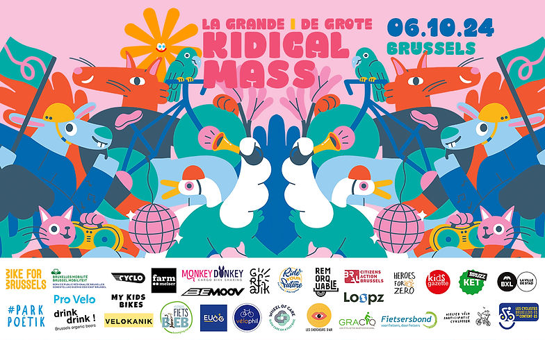
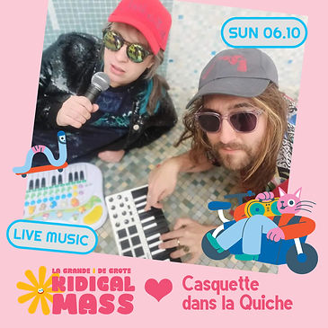
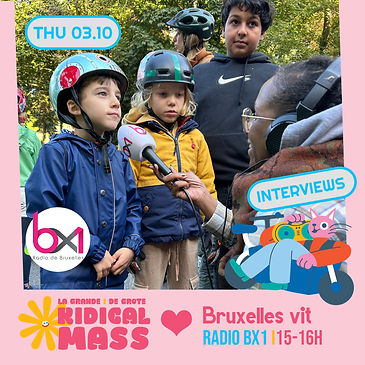
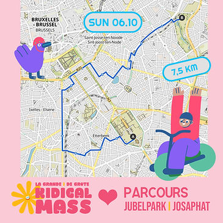
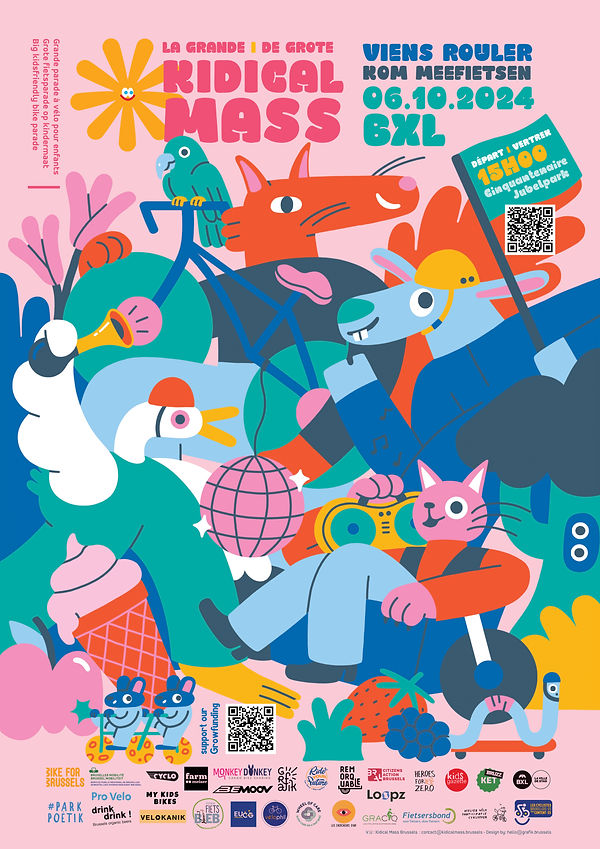

top of page

Skip to Main Content

Rejoignez-nous en famille pour fêter 4 ans des parades cyclistes Kidical à Bruxelles ! Cette année, nous sommes 13 groupes locaux qui organisent pas moins de 60 parades à travers la ville ! Le dimanche 6 octobre, venez participer à notre grande Kidical Mass annuelle : un événement magique, plein de surprises et d’animations tout au long du parcours ! Avec le soutien d’une multitude de partenaires engagés, cette édition promet d’être encore plus festive et engagée ! #Kidical2024 #cocréation 

Kom met het hele gezin 4 jaar Kidical fietsparades in Brussel vieren! Dit jaar zijn we met 13 lokale groepen die niet minder dan 60 parades door de stad organiseren! Op zondag 6 oktober kan je meedoen aan onze grote jaarlijkse Kidical Mass: een magisch evenement, vol verrassingen en animaties onderweg! Met de steun van een groot aantal partners belooft deze editie nog feestelijker en geëngageerder te worden! #Kidicalmass2024 #co-creatie

INFO PRATIQUE - PRAKTISCHE INFO

Rendez-vous à 15h au parc du Cinquantenaire (en dessous de l'arc de Triomphe). Nous ferons une balade de 6 km à travers la ville. Voici le [Parcours.](https://www.komoot.com/fr-fr/tour/1880392838?share_token=asdDdDmSvNXV5GMNpqWiO0vGoY3ErGv4H5CbaNUG5f9dntcuNz&ref=)

​

Afspraak om 15u in het Jubelpark (onder de Triomfboog)

We maken een fietstocht van ongeveer 6km door de stad. ​Bij deze het [Parcours.](https://www.komoot.com/fr-fr/tour/1880392838?share_token=asdDdDmSvNXV5GMNpqWiO0vGoY3ErGv4H5CbaNUG5f9dntcuNz&ref=)

​

PROGRAMME - PROGRAMMA

-   14:45 Petites réparations/kleine herstellingen
    
-   15:00 Grand Rassemblement / Grote Bijeenkomst
    
-   15:10 Briefing Gilets Roses/ briefing begeleiders
    
-   15:20 Speech & consignes de sécurité / Speech & veiligheidsvoorschriften
    
-   15:30 Grand départ / Grote Vertrek + Animations\* 
    
-   16:30 Arrivée & Animations / Aankomst & animaties\*
    
-   18:00 Fin/Einde
    

​

ANIMATIONS - ANIMATIES\*

-   Petites réparations/ kleine herstellingsen (Cyklopper -  Vélophil - Vélokanik)
    
-   Cuistax parc Poetik Casquette Dans La Quiche (pop)(live music) 
    
-   DJ sets Gelukwens, Jangojim, Jaak + many others
    
-   Remorques Team revendications / stad op kindermaat (Fietsersbond/gracq, Heroes4zero, Chercheurs d'Air, Cyclo)
    
-   QUIZ + goodies par nos partenaires/ QUIZ en goodies aangeboden door onze partners
    
-   Foodtrucks velo (welkom!) 
    
-   Wheel of Care (EHBO)​​ 
    
-   Course à vélo enfants (Bemoov) (à l'arrivée/bij aankomst) 
    
-   Pedalo Cantabile (chant et karaoké)
    
-   Fanfakids orkest (Live music) (à l'arrivée/bij aankomst) 
    

​

Départs groupés/ gezamelijke vertrekplaatsen

-   Forest/Vorst : 13h30 Square Lainé
    
-   Saint-Gilles/Sint-Gilis : 13h45 Place Moricharplein
    
-   Schaerbeek /Schaarbeek : 14h15 Mini Golf Josaphat park
    
-   Woluwé/Woluwe : 14h15 Square Meudon
    
-   Bruxelles Ville / Brussel Stad : 14h00 Parc Royale (fontaine en face du parlement/fontein aan het parlement)
    
-   Watermaal / Bosvoorde 14h- Plaine de jeux (Rue de la Houlette)
    
-   Ixelles : 14h Place Flagey
    
-   Cinquantenaire/Jubelpark: 15h Grand rassemblement
    

​

APPEL AUX BENEVOLS - OPROEP VRIJWILLIGERS

Voici le [formulaire](https://docs.google.com/forms/d/e/1FAIpQLSdNZzTm25XuxtjmTE-w-oNwTh340UOfSczglDhilU0wQbsoTA/viewform) pour t'inscrire comme bénévole/accompagnateur

Wil je ons helpen? Dat kan zeker, [schrijf je snel in](https://docs.google.com/forms/d/e/1FAIpQLSdNZzTm25XuxtjmTE-w-oNwTh340UOfSczglDhilU0wQbsoTA/viewform)! 

​

GROWFUNDING

Aidez-nous à renforcer la culture du vélo voor een (fiets)stad op kindermaat ! [www.growfunding.be/kidicalmass](http://www.growfunding.be/kidicalmass)​ 

​​

PARTENARIAT - PARTNERSCHAP

​

🔹Bruxelles Mobilité - Brussel Mobiliteit 🔹Cyclo Bxl 🔹Pro Velo Bruxsel 🔹Monkey Donkey 🔹 Färm 🔹Velophil 🔹Fietsersbond Brussels Gewest 🔹Grafik 🔹WHEEL of CARE 🔹GRACQ Bruxelles 🔹Les chercheurs d'air 🔹Remorquable ASBL 🔹Heroes for Zero 🔹Loopz🔹 My Kids Bikes 🔹Kidsgazette 🔹BRUZZ 🔹VELOKANIK 🔹Cyklopper Forest 🔹Rideyourfuture Asbl 🔹BRAL.brussels 🔹DrinkDrink 🔹Fietsbieb 🔹Les cyclistes bruxellois‧es sont content‧es 🔹 Bemoov 🔹EUCG 🔹 [Succulente](https://succulente.be)[🔹](https://succulente.be) [Alveus](https://succulente.be)

🤝Pour une culture vélo vibrante et une ville adaptée aux enfants! 🤝Voor een levendige fietscultuur en een kindvriendelijke stad!​​

​

COMMUNIQUE DE PRESSE - PERSBERICHT

7 oktober/octobre 2024

Kidical Mass mobilise près de 1 150 parents et enfants pour revendiquer une ville plus adaptée aux enfants

[Communiqué revendications Grande Kidical Mass 2024](https://www.kidicalmass.be/_files/ugd/cf0153_93a3decd79b74d1595233c7f93464dc3.pdf)

Kidical Mass mobiliseert bijna 1.150 ouders en kinderen om een fiets en kindvriendelijkere stad te eisen

[Persbericht eisen Grote Kidical Mass 2024](https://www.kidicalmass.be/_files/ugd/cf0153_72d2f4caec3f461cb95a5526d0a4730e.pdf)

​

Vous souhaitez proposer quelque chose avec votre organisation ou nous soutenir ? Be our guest ! Contactez-nous sur : [contact@kidicalmass.brussels](mailto:contact@kidicalmass.brussels). Plus d'infos sur la [Grande Kidical 2023](https://www.kidicalmass.be/2023).

​

Wil je iets voorstellen met jouw organisatie of ons steunen? Be our guest! Neem contact met ons op via: [contact@kidicalmass.brussels](mailto:contact@kidicalmass.brussels). 

​

​Communication templates - visuals - texts (tag Kidical Mass Brussels) [GOOGLE DOC](https://drive.google.com/drive/u/1/folders/1G3-17azjVZi0SNBs6aYttfgC8DFPCds3)

bottom of page
