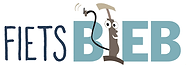
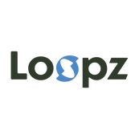
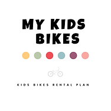
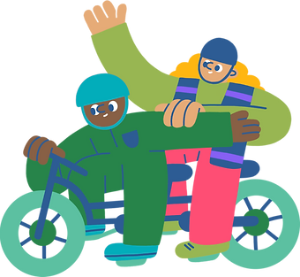
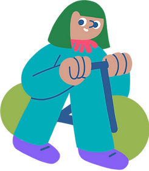
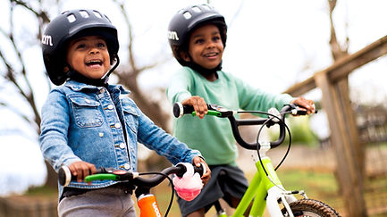
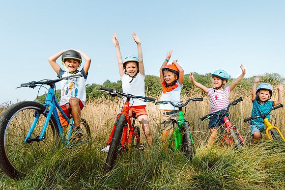

top of page

Skip to Main Content

###### Help? Je n'ai pas de vélo ! 

###### Bons plans pour un vélo pas cher/gratuit

​​​

###### Vélos d'occasion

L'atelier vélo Cyclo vend des vélos d'occasion. Cet atelier est situé rue de Flandre 85 à 1000 Bruxelles. Horaires : [cyclo.org](http://www.cyclo.org/fr/locatie/atelier-cyclo).

​

D'autres filières existent encore, les sites du [Gracq](http://www.gracq.org/) et de [Pro Velo](http://www.provelo.org/) reprennent toute une série d'adresses utiles.

​

###### Emprunter un vélo enfant

La [Vélothèque](https://fietsbieb.be/fr/) vous permet d'emprunter un vélo d'enfant à peu de frais. Les vélos conviennent aux enfants jusqu'à 12 ans. Pour utiliser un vélo d'enfant pendant un an, vous payez un abonnement de 20 € et une caution de 20 €.

​

Il y des vélothèques dans les communes suivantes à Bruxelles : 

-   [Anderlecht](https://fietsbieb.be/aanbod/brussel-bhg/anderlecht)
    
-   [Ixelles](https://fietsbieb.be/aanbod/brussel-bhg/elsene)
    
-   [Etterbeek](https://fietsbieb.be/aanbod/brussel-bhg/etterbeek)
    
-   [Jette](https://fietsbieb.be/aanbod/brussel-bhg/jette)
    
-   [Laeken](https://fietsbieb.be/aanbod/brussel-bhg/laken)
    
-   [Molenbeek](https://fietsbieb.be/aanbod/brussel-bhg/molenbeek)
    
-   [Neder-Over-Heembeek (under construction)](https://fietsbieb.be/aanbod/brussel-bhg/neder-over-heembeek)
    
-   [Schaerbeek](https://fietsbieb.be/aanbod/brussel-bhg/schaarbeek)
    
-   [Berchem](https://fietsbieb.be/aanbod/brussel-bhg/sint-agatha-berchem)
    
-   [Uccle](https://fietsbieb.be/aanbod/brussel-bhg/ukkel)​
    

​

Location de vélos enfants

Loopz.bike est une plateforme innovante qui vous permet de souscrire à des abonnements de vélos pour enfants via nos magasins partenaires locaux. Notre mission est de rendre les vélos de qualité accessibles à tous, avec des formules débutant à seulement 6€ par mois !

​

Plus d'info sur [https://loopz.bike/fr/](https://loopz.bike/fr/) 

​​

Offre spéciale pour les participants Kidical Mass 

Loopz offre une promotion exclusive à tous les adhérents de la Kidical Mass. Avec le code KIDICALMASS, obtenez vos 2 premiers mois offerts. Ne manquez pas cette opportunité pour découvrir la valeur de notre solution et faire le premier pas vers une expérience de vélo sans stress pour vos enfants ! 

​​​\_\_

My Kids Bikes: 

Nous vous proposons des abonnements vélos enfants "zero souci"

Nous avons sélectionné les vélos pour enfants les plus légers et les plus ergonomiques du marché: nous vous proposons les abonnements avec des vélos des marques Woom et BeMoov.

Plus d'info sur [https://www.mykidsbikes.be](https://www.mykidsbikes.be)

​

My Kids Bikes sponsor de Kidical Mass Brussels

​​\_\_

Tu connais encore des bonnes adresses? 

Partages-les avec nous: [contact@kidicalmass.brussels](mailto:contact@kidicalmass.brussels)

\_\_\_​

NL

###### Help? Ik heb geen fiets! 

###### Tips voor goedkoop of bijna gratis fietsen

###### ​

###### Tweedehandsfietsen

Het fietsatelier Cyclo verkoopt tweedehandsfietsen. Dit atelier bevindt zich op de Vlaamsesteenweg 85 in 1000 Brussel. Voor de openingsuren: [cyclo.org](http://www.cyclo.org/nl/locatie/cyclo-atelier)

​

Je kan ook op andere plaatsen terecht, op de websites van de [Fietsersbond](http://www.fietsersbond.be/) en [Pro Velo](http://www.provelo.org/nl) vindt u heel wat nuttige adressen.

​

###### Kinderfiets uitlenen 

Bij de [Fietsbieb](https://fietsbieb.be) kan je kinderfietsen goedkoop lenen. Ze hebben een aanbod voor kinderen tot 12 jaar. Met een abonnement van € 20 en een waarborg van € 20 mag je één jaar lang een kinderfiets gebruiken.

​

Er zijn fietsbiels in deze Brusselse gemeentes: 

-   [Anderlecht](https://fietsbieb.be/aanbod/brussel-bhg/anderlecht)
    
-   [Elsene](https://fietsbieb.be/aanbod/brussel-bhg/elsene)
    
-   [Etterbeek](https://fietsbieb.be/aanbod/brussel-bhg/etterbeek)
    
-   [Jette](https://fietsbieb.be/aanbod/brussel-bhg/jette)
    
-   [Laken](https://fietsbieb.be/aanbod/brussel-bhg/laken)
    
-   [Molenbeek](https://fietsbieb.be/aanbod/brussel-bhg/molenbeek)
    
-   [Neder-Over-Heembeek](https://fietsbieb.be/aanbod/brussel-bhg/neder-over-heembeek)
    
-   [Schaarbeek](https://fietsbieb.be/aanbod/brussel-bhg/schaarbeek)
    
-   [Sint-Agatha-Berchem](https://fietsbieb.be/aanbod/brussel-bhg/sint-agatha-berchem)
    
-   [Ukkel](https://fietsbieb.be/aanbod/brussel-bhg/ukkel)​
    

​

Huur een kinderfiets

​

Loopz.bike is een innovatief platform waarmee je abonnementen voor kinderfietsen kunt afsluiten via onze lokale partnerwinkels. Onze missie is om kwaliteitsfietsen voor iedereen toegankelijk te maken, met pakketten vanaf slechts €6 per maand!

Meer info op [https://loopz.bike/nl](https://loopz.bike/nl/)

Speciale aanbieding voor Kidical Mass deelnemers 

Loopz biedt een exclusieve promotie aan alle Kidical Mass leden. Met de code KIDICALMASS krijg je de eerste 2 maanden gratis. Mis deze kans niet om de waarde van onze oplossing te ontdekken en de eerste stap te zetten naar een zorgeloze fietservaring voor je kinderen! 

​

\_\_

My Kids Bikes

Wij bieden “zorgeloze” kinderfietsabonnementen

We hebben de lichtste en meest ergonomische kinderfietsen op de markt geselecteerd: we bieden je abonnementen met fietsen van Woom en BeMoov.

Meer info op [https://www.mykidsbikes.be](https://www.mykidsbikes.be)

My Kids Bikes sponsor van Kidical Mass Brussel

​​

###### Heb je nog tips ?

Deel ze gerust : [contact@kidicalmass.brussels](mailto:contact@kidicalmass.brussels)

​

bottom of page
