top of page

Skip to Main Content

[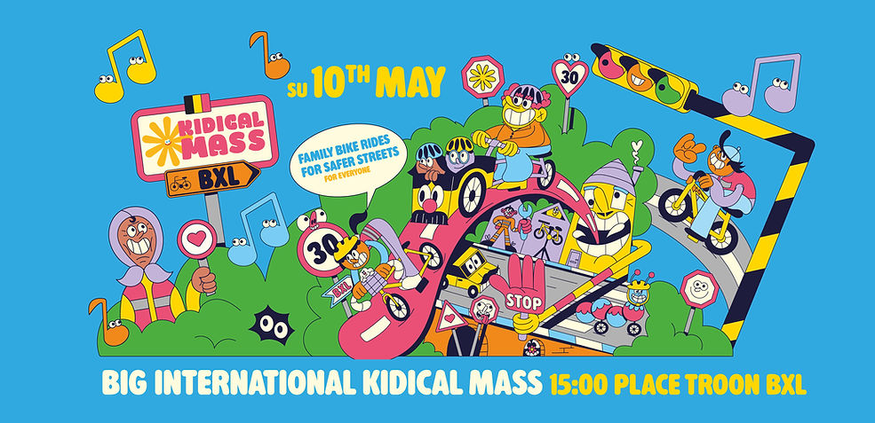](https://www.facebook.com/events/1432710188502103)

[Kidical Newsletter / Nieuwsbrief](https://docs.google.com/forms/d/e/1FAIpQLSdB_MfyjqEMhIrvkKQZTm5ZLcZWo2Ww7RkJfqieIQV4OFwxcA/viewform?pli=1)

## Alle data & locaties hier!  
Toutes les dates et lieux ici !

[Calendrier - Kalender 2026](https://www.kidicalmass.be/agenda)

​

###### APRIL - AVRIL - APRIL  
19/4  [Kidical Mass](https://www.facebook.com/events/1669046660645535) [Evere – Haren](https://www.facebook.com/events/1669046660645535)  
[19/4  Kidical Mass Ixelles - Elsene](https://www.facebook.com/events/1669046660645535)  
26/4  [Kidical Mass](https://www.facebook.com/events/1669046660645535) Forest - Vorst  
26/4  [Kidical Mass](https://www.facebook.com/events/1669046660645535) Woluwe-Saint-Pierre – Woluwe-Saint-Lambert

###### ​

###### MAY - MAI - MEI  
03/05  [Kidical Mass](https://www.facebook.com/events/1669046660645535) Neder-Over-Heembeek   
10/05  [GRANDE GROTE Kidical Mass (Inter)Nationa](https://www.facebook.com/events/1432710188502103)l 15H/U Place Troon  
17/05  Kidical Mass Mons (Wallonie)  
24/05  [Kidical Mass](https://www.facebook.com/events/1669046660645535) Woluwe-Saint-Pierre & Woluwe-Saint-Lambert / ​  
Woluwe-Sint-Pieters & Woluwe-Sint-Lambrechts  
24/05  [Kidical Mass](https://www.facebook.com/events/1669046660645535) Bruxelles Ville - Brussel Stad  
31/05  [Kidical Mass](https://www.facebook.com/events/1669046660645535) Namur - Namen (Wallonie)  
31/05  [Kidical Mass](https://www.facebook.com/events/1669046660645535) Schaerbeek - Schaarbeek  
31/05  [Kidical Mass](https://www.facebook.com/events/1669046660645535) Watermael-Boitsfort - Watermaal Bosvoorde & Auderghem - Oudergem

​

[FULL CALENDAR & PRACTICAL INFO](https://www.kidicalmass.be/agenda)

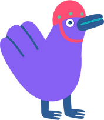

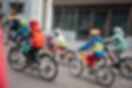

\_51A2371

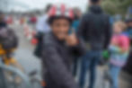

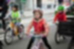

\_51A2147

\_51A2371

1/16

La Kidical Mass Belgium est un réseau national de groupes locaux Kidical Mass qui organisent des parades cyclistes festives, sécurisées et à hauteur d’enfant, partout en Belgique. Notre objectif : donner envie à plus d’enfants, et de parents, de se déplacer à vélo, au quotidien comme pour le plaisir.

​

Lors de chaque parade, les participants apportent de la musique et une ambiance joyeuse. Nous roulons au rythme des enfants, sur des itinéraires soigneusement choisis, et dans le respect du code de la route. Les cortèges sont encadrés par des bénévoles formés afin de garantir une expérience conviviale et sécurisée pour toutes et tous. Une Kidical Mass, c’est aussi une formidable manière de découvrir ou redécouvrir sa commune, ses parcs, ses quartiers et ses lieux adaptés aux familles. Pour les enfants, c’est l’occasion de se faire de nouveaux amis et de prendre confiance à vélo dans l’espace public.

​

Née en 2020, la dynamique Kidical Mass s’est d’abord développée fortement à Bruxelles, avant de s’étendre en Wallonie et en Flandre. Aujourd’hui, Kidical Mass Belgium fédère des groupes locaux dans tout le pays. Ensemble, ils ont co-organisé plus de 60 parades en 2024, avec l’ambition de continuer à grandir et d’accompagner la création de nouveaux collectifs locaux. Viens rouler avec nous et rejoins le mouvement pour des villes et villages plus sûrs, plus joyeux et plus cyclables pour les enfants !

### ​\_\_

Kidical Mass Belgium is een nationaal netwerk van lokale Kidical Mass-groepen die overal in België feestelijke, veilige fietsparades op kindermaat organiseren.  
Ons doel: meer kinderen, en ouders, op de fiets krijgen, in het dagelijkse leven én voor het plezier.

Tijdens elke parade zorgen de deelnemers voor muziek en een vrolijke sfeer. We fietsen op het tempo van de kinderen, volgen zorgvuldig uitgestippelde routes en respecteren de verkeersregels. De fietstocht wordt begeleid door opgeleide vrijwilligers, zodat iedereen veilig en ontspannen kan meefietsen.

Een Kidical Mass is ook een ideale manier om nieuwe plekken in je gemeente te ontdekken: parken, buurten en kindvriendelijke locaties. Voor onze ketjes is het dé kans om nieuwe vriendjes en vriendinnetjes te maken en zelfvertrouwen op te bouwen in het verkeer.

Kidical Mass ontstond in 2020 en kende eerst een sterke groei in Brussel, gevolgd door een uitbreiding naar Wallonië en Vlaanderen. Vandaag verbindt Kidical Mass Belgium lokale groepen over het hele land. Samen organiseerden zij meer dan 60 parades in 2024, met de ambitie om verder te groeien en nieuwe lokale initiatieven te ondersteunen. Fiets je mee en bouw samen met ons aan kindvriendelijke, veilige en leefbare steden en dorpen in heel België!

###### Appel aux bénévoles  
Oproep vrijwilligers  
2026

Viens accompagner ou animer la Kidical près de chez toi !  La Kidical, c’est ta fête de quartier, 100% vélo,  4 meetups gourmand par an, plein de nouveaux potes…  et une masse de kets contents !

Kom mee de Kidical in jouw buurt begeleiden of animeren!  De Kidical is jouw buurtfeest, 100% fiets, 4 yummy meetups per jaar, massa’s nieuwe fietsbuddy’s… en een hoop blije ketjes!

[Je participe ! Ik doe mee !](https://www.kidicalmass.be/volunteer)

###### Kidical Mass en Wallonie

###### ​​

-   ###### [Mons](https://www.kidicalmass.be/7000) 2025
    
-   ###### [Namur](https://www.kidicalmass.be/5000) 2024
    
-   ###### [Mouscron](https://www.facebook.com/events/3557808487868290/3557808501201622/) 2024
    
-   ###### La Hulpe [2023](https://www.facebook.com/photo.php?fbid=698005239032435&set=pb.100064688949395.-2207520000&type=3) 
    
-   ###### Tubize 2023
    
-   ###### [Liege](https://www.kidicalmassliege.org) 2022
    

Tu veux créer ta Kidical Mass locale ? Génial ! On te soutient à chaque étape. Écris-nous à [bike@kidicalmass.be](mailto:bike@kidicalmass.be), on est impatients de t’aider à pédaler ensemble !

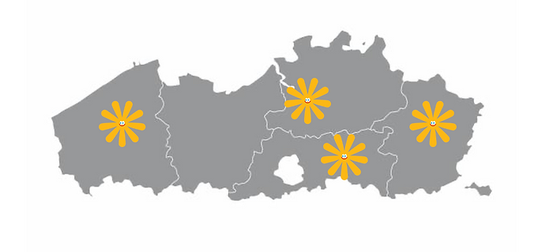

###### Kidical Mass in Vlaanderen

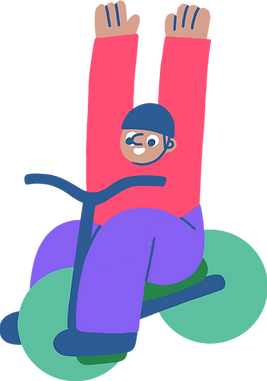

Wil je graag een lokale Kidical Mass opstarten? Geweldig! We steunen je bij elke stap. Schrijf ons op [bike@kidicalmass.be](mailto:bike@kidicalmass.be), we kunnen niet wachten om samen te fietsen!

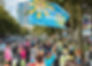

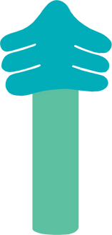

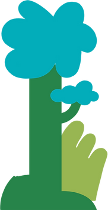

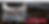

# Soutenez notre Spacefunding !  
Steun onze Spacefunding!

Vous pouvez faire la différence ! Tout coup de pouce compte. Aidez-nous à continuer cette belle aventure et à mettre toujours plus d’enfants en selle !

​Jij kunt het verschil maken! Elke bijdrage telt. Help ons deze prachtige beweging voort te zetten en nog meer kinderen op de fiets te krijgen!

​

Donation unique ici/ Eénmalige donaties hier:

Kidical Mass Belgium - ​BE72 8919 4405 3116 (VDK)​​

Want to be a sponsor ? [bike@kidicalmass.be](mailto:bike@kidicalmass.be)

[Spacefunding Kidical Mass](https://growfunding.be/fr/projects/kidicalmassbelgique)

###### NEWS

###### "Avec notre réseau de groupes Kidical mass nous n'organisons pas seulement des événements mais cultivons également une communauté de cyclistes dynamique dans chaque commune, enrichissant ainsi la culture du vélo à Bruxelles."  
#kidicalmass #movement 

###### In 2025 we were more than 100 active citizens in 16 Brussels municipalities  
to organise 60 Kidical Mass parades  
to claim child- & bicycle-friendly city.  
#kidicalmass #movement   
 

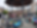

###### Infos pratiques I Praktische Info

###### ​

-   Départ I Vertrek : lieu (fixe) par commune / (vaste) plek per gemeente
    
-   Tous âges I Alle leeftijden : +- 4 > 12 jaar/ans + sympathisants
    
-   Sur un vélo/pas de draisiennes - Op de fiets of achterop /geen loopfiets
    
-   Parcours max. 5 - 7 km (rythme lent - traag tempo) 
    
-   Durée I Duur max. 1 heure - uur 
    
-   Gratuit I Gratis (sans inscription - zonder inschrijving)
    
-   Musique en cours de route I Muziek onderweg
    

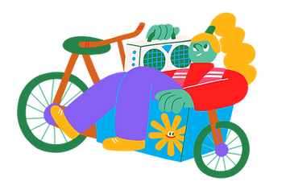

## 2022

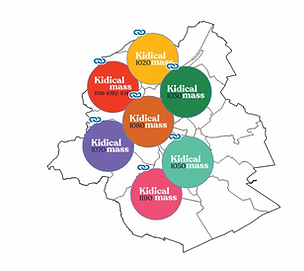

## 2024

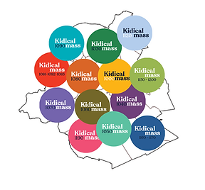

We are growing!

2020 I 1 group

2021 I 4 groups 

2022 I 7 groups

2023 I 10 groups 

2024 I 13 groups 

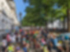

[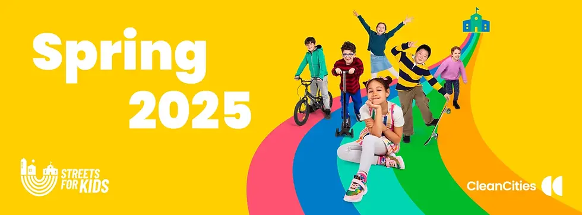](https://cleancitiescampaign.org/streets-for-kids-spring-2025/)

###### Proud partner of the #StreetsForKids campaign by Clean Cities. More [info](https://cleancitiescampaign.org/streets-for-kids-spring-2025/). 

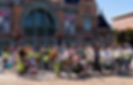

###### Want to be our Partner/Sponsor? (local/regional) [Mail](mailto:contact@kidicalmass.brussels?subject=partnership) us!

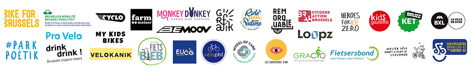

Avec le soutien financier de / Dankzij steun van :

Bruxelles Mobilité/ Brussel Mobiliteit, Clean Cities,

Bruxelles Ville/Brussel Stad, La commune de Schaerbeek

/ gemeente Schaarbeek en onze/et nos [spacefunders](https://growfunding.be/fr/projects/kidicalmassbruxelles).

bottom of page
