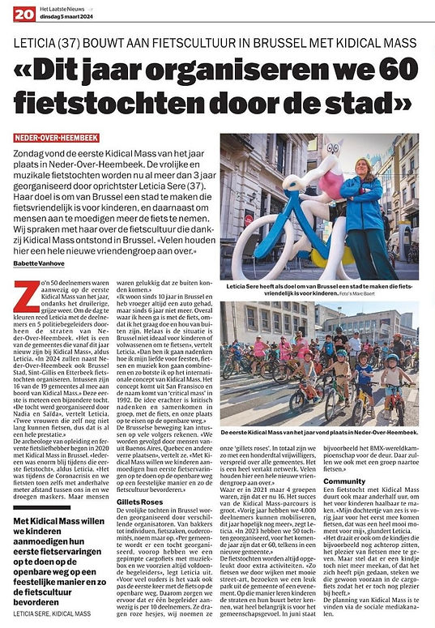

top of page

Skip to Main Content

Leticia (37 ans) construit une culture du vélo à Bruxelles avec Kidical Mass :

###### "Cette année, nous organisons 60 balades à vélo à travers Bruxelles."

Dimanche dernier, la première Kidical Mass de l'année a eu lieu à Neder-Over-Heembeek. Les joyeuses et musicales balades à vélo sont organisées depuis plus de 3 ans par la fondatrice Leticia Sere (37 ans). Son objectif est de faire de Bruxelles une ville accueillante pour les enfants à vélo, tout en encourageant les gens à utiliser davantage ce moyen de transport. Nous avons discuté avec elle de la culture vélo qui a émergé à Bruxelles grâce à Kidical Mass. "Beaucoup se font ici de nouveaux amis."

Environ 50 participants ont pris part à la première Kidical Mass de l'année, malgré le temps maussade et gris. Pour égayer la journée, Leticia a conduit les participants et 5 agents de police à vélo à travers les rues de Neder-Over-Heembeek. "C'est l'une des communes qui organisent pour la première fois des balades Kidical Mass cette année", a déclaré Leticia. "En 2024, en plus de Neder-Over-Heembeek, Bruxelles-Ville, Saint-Gilles et Etterbeek organiseront des balades à vélo. Entre-temps, 16 des 19 communes ont déjà rejoint Kidical Mass." Cette première sortie est déjà une expérience spéciale. "La balade a été organisée par Nadia et Saïda", explique Leticia. "Deux femmes qui n'ont appris à rouler il n'y a que quelques années, ce qui est déjà un grand exploit."

Archéologue de formation et passionnée de vélo, Leticia a lancé Kidical Mass à Bruxelles en 2020. "Tout le monde était tellement heureux lors de cette première balade à vélo", dit Leticia. "C'était pendant la crise du Covid et nous roulions même avec un mètre et demi de distance entre nous et en portant des masques. Mais les gens étaient heureux de pouvoir sortir."

"Je vis à Bruxelles depuis 10 ans et j'avais toujours une voiture auparavant, mais plus depuis 6 ans. Je me déplace partout à vélo, car j'aime ça et j'aime être à l'extérieur. Malheureusement, la situation à Bruxelles n'est pas idéale pour les enfants ou les adultes qui veulent faire du vélo", raconte Leticia. "C'est alors que j'ai réfléchi à la manière de combiner mon amour pour les fêtes, le vélo et la musique, et c'est ainsi que j'ai découvert le concept international de Kidical Mass. Le concept vient de San Francisco et le nom vient de 'critical mass' en 1992. L'idée est de réfléchir de manière critique et de se rassembler pour créer une masse critique, à vélo et revendiquer notre place sur la route. Car la route appartient toujours à tout le monde."

Le mouvement bruxellois est donc un concept repris qui existe depuis plus de 30 ans. De plus, l'initiative est très populaire dans d'autres pays et la version bruxelloise de Leticia compte de nombreux adeptes. "Nous sommes suivis par des gens de Buenos Aires, de Québec et d'autres endroits lointains", dit-elle. "Avec Kidical Mass, nous voulons encourager les enfants à faire leurs premières expériences à vélo sur la voie publique de manière festive et ainsi promouvoir la culture vélo."

Les joyeuses balades à Bruxelles sont organisées par différents organisateurs. Des boulangers aux individus, en passant par les magasins de vélos, les comités de parents, etc. "Une balade est organisée par commune, nous avons un vélo cargo customisé en tête avec un système audio et nous fournissons toujours suffisamment d'accompagnateurs", explique Leticia. "Pour de nombreux parents, c'est souvent la première fois qu'ils utilisent un vélo sur la route. C'est pourquoi nous veillons à ce qu'il y ait un accompagnateur pour 10 participants. Ils portent des gilets roses, nous les appelons nos 'gillets roses'. Au total, nous sommes une centaine de volontaires répartis dans toutes les communes. C'est un réseau très étendu." La plupart des volontaires sont des citoyens ordinaires qui n'ont aucun lien avec le vélo. "Beaucoup se font ici de nouveaux amis."

En 2021, il y avait 4 groupes, maintenant il y en a 16. Le succès des parcours de Kidical Mass est grand. "L'année dernière, nous avons pu mobiliser 4 000 participants, cette année j'espère que ce sera encore plus", déclare Leticia. En 2023, nous avons organisé 50 balades, pour l'année à venir, ce sera 60, à chaque fois dans une nouvelle commune." Les balades à vélo sont toujours agrémentées d'activités supplémentaires. "Nous passons par des quartiers avec de belles œuvres d'art de rue, visitons un parc sympa de la commune ou un événement. De cette manière, les enfants apprennent à mieux connaître les rues et leur quartier, ce qui est très important pour le sentiment communautaire. En juin, par exemple, le championnat du monde de BMX approche. Nous nous rendrons également en groupe à cet événement."

Une balade à vélo avec Kidical Mass ne dure qu'une heure et demie, pour la rendre accessible aux enfants. "Ma fille de six ans est venue pour la première fois l'année dernière, c'était un moment très spécial pour moi", se réjouit Leticia. "Avant cela, elle était toujours assise derrière moi."

"Kidical Mass est un mouvement citoyen unique de passionnés de vélo qui n'ont en réalité rien à voir avec le vélo lui-même, mais qui construisent quand même une belle 'communauté'. Cette culture vélo ne se résume pas qu'à faire du vélo", poursuit Leticia. "Il s'agit également des enfants qui, par exemple, sont encore assis à l'arrière, du plaisir de faire du vélo en général. Mais si jamais un enfant ne peut plus suivre, ou s'est blessé, nous le plaçons simplement à l'avant du vélo cargo pour qu'il puisse quand même s'amuser."

Maintenant que le printemps approche, une balade à vélo semble déjà beaucoup plus attrayante que les semaines froides précédentes. Retrouvez le planning kidical sur site et réseaux sociaux de Kidical Mass Brussels. 

​

[Publié dans Het Laatste Nieuws - Journaliste Babette Vanhove](https://www.hln.be/brussel/leticia-37-bouwt-aan-een-fietscultuur-in-brussel-met-kidical-mass-dit-jaar-organiseren-we-60-fietstochten-doorheen-brussel~a2dc9830/)

​

[www.kidicalmass.brussels](http://www.kidicalmass.brussels) @Kidicalmassbrussels 

bottom of page
