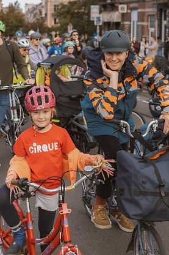
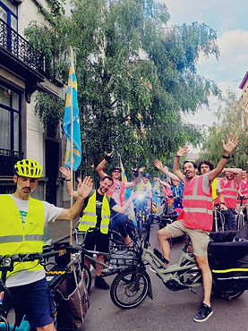

top of page

Skip to Main Content

###### Le projet Kidical Mass Belgium

La Kidical Mass Belgium organise des parades cyclistes festives pour les enfants, afin d'inciter davantage d’enfants (et de parents) à se déplacer à vélo. Accompagnés de musique en cours de route. Nous pédalons au rythme des enfants et respectons le code de la route. La Kidical Mass est le moyen idéal pour les enfants de découvrir de nouveaux endroits dans votre commune, et de se faire de nouveaux potes ! Nous choisissons toujours un itinéraire différent le long des parcs, des terrains de jeux ou des événements pour enfants. Nous avons commencé en 2020 et sommes maintenant sur 16 communes Bruxelloises, plus de 6 groupes en Wallonie et en Flandre, avec un total de + de 60 parades coorganisées en 2025. Viens rouler avec nous !

Kidical Mass - 5 ans de mise en selle à Bruxelles et en Belgique!  
 

​Notre public cible : Les familles, les (petits) enfants 3 - 12 ans et les jeunes.

-   Nos activités/formations pendant le weekend (accessibles pour les parents). Les balades Kidical Mass ont lieu les dimanches après-midi. 
    
-   La fréquence de nos évènements : 2 x semaine en 2025 / 2026
    
-   150 parades festives ( plus de 80-100 participants en moyenne) depuis 2020, 60 parades en 2025, offrant une expérience ludique et [sécurisée tout en promouvant le code](https://www.youtube.com/watch?v=i9YQxJ-ChNM) de la route pour les jeunes cyclistes et la culture du vélo à Bruxelles.
    
-   120 bénévoles sont actifs dans 16 des 19 communes bruxelloises, et en 6 villes de Wallonie et Flandre, soutenant la demande pour plus d’infrastructure cyclable, des abords d'écoles mieux sécurisés, ainsi que pour le respect de la zone 30 km/h en ville
    
-   Plus de 16 nouvelles communautés de cyclistes locaux (mettre en liens les parents, acteurs locaux, associations et partenaires privés au sein des communes). 
    
-   Les communes qui approuvent nos activités et nous soutiennent avec leurs moyens. Bonne collaboration avec les différentes brigades cyclistes.
    
-   Structure et [organisation](https://www.kidicalmass.brussels/organisation) centralisée et participative.
    
-   5500 enfants et parents ont participé en 2024, et encore plus en 2025! ​
    

​

Missions de base

La Kidical Mass Belgium est une initiative visant à promouvoir une culture cycliste inclusive et accessible pour les jeunes et leurs familles, avec des missions principales axées autour de la mise en selle, l’apprentissage encadré du vélo en ville, la cohésion sociale au niveau communal, et le renforcement de la culture cycliste en Belgique. En collaboration avec les citoyens, associations, autorités locales, Kidical Mass accompagne les (futurs) cyclistes dans toutes les étapes de leur parcours : apprendre à rouler dès le plus jeune âge, se déplacer en sécurité et en confiance, adopter le vélo au quotidien, et inspirer leur entourage à faire de même.

###### Découvrez nos activités autour des 3 axes : 

a) Débuter : encourager la mise en selle avec des évènements hebdomadaires

Nous organisons des événements hebdomadaires pour initier les familles au vélo dans un cadre sécurisé. Nos actions d’information et d’accompagnement lèvent les freins liés à la logistique, à la circulation ou au manque d’expérience. Nous ciblons les familles avec des enfants de 3 à 12 ans, en accordant une attention particulière aux débutants et jeunes enfants. 

​

b) Accompagner l’adoption d’une pratique régulière et améliorer la sécurité routière

​

Des balades encadrées permettent aux cyclistes novices de gagner confiance dans la circulation, de choisir le bon vélo et d’apprendre à l’entretenir. Cela facilite l’adoption du vélo comme moyen de transport quotidien et renforce la sécurité routière. De plus 65% des élèves habitent à moins 1km de leur école. 

​

c) Rayonner : promouvoir la culture du vélo à Bruxelles et en Belgique

En collaboration avec citoyens, associations et communes, nous développons une culture cycliste en Belgique. Nos activités encouragent les familles à explorer leur quartier à vélo, favorisant la cohésion sociale et le développement durable. 

Notre fonctionnement est inclusif et solidaire. Nous trouvons des solutions sur mesure pour les enfants en précarité ou avec handicap. Notre objectif est de représenter la diversité de chaque commune dans chaque Kidical. Nous aidons les enfants/parents [sans vélo](https://www.kidicalmass.brussels/help-je-n-ai-pas-de-v%C3%A9lo) à trouver le leur pour un petit budget ou même gratuitement. 

En étant visible dans les rues, la Kidical Mass prône de façon ludique une [ville plus adaptée aux enfants](https://www.kidicalmass.brussels/what-we-want). A travers la Grande Kidical annuelle nous rappelons nos revendications : Respect de la zone 30, abords d’école sécurisés, créations de parkings vélo family friendly (longtails, cargo), plus de pistes cyclables séparées. 

###### Omschrijving van het Kidical Mass project in Brussel

Kidical Mass Belgium organiseert feestelijke fietsparades voor kinderen om meer kinderen (en ouders) aan te moedigen om de fiets te nemen. Onderweg worden we begeleid door muziek. We fietsen op het tempo van de kinderen en respecteren de verkeersregels. Kidical Mass is de ideale manier voor kinderen om nieuwe plekken in hun gemeente te ontdekken en nieuwe vrienden te maken! We kiezen altijd een andere route langs parken, speeltuinen of kinderevenementen. We zijn gestart in 2020 en zijn inmiddels actief in 16 Brusselse gemeenten, met in totaal 60 parades in 2024. Kom mee fietsen!

Kidical Mass Belgium – 5 jaar op weg in België

​

-   5.500 kinderen en ouders namen in 2024 deel aan onze fietsparades
    
-   Onze doelgroep: Gezinnen, (jonge) kinderen van 3 tot 12 jaar en jongeren.
    
-   Onze activiteiten en opleidingen in het weekend (ook toegankelijk voor ouders). De Kidical Mass-tochten vinden plaats op zondagmiddag.
    
-   Frequentie van onze evenementen: 2x per week in 2025 / 2026
    

​

Onze impact sinds 2020

-   150 feestelijke parades (gemiddeld 80-100 deelnemers) sinds 2020, waaronder 60 in 2024. Een speelse en veilige ervaring die de verkeersregels en fietscultuur in België promoot.
    
-   120 vrijwilligers actief in 16 van de 19 Brusselse gemeenten, die zich inzetten voor betere fietsinfrastructuur, veiligere schoolomgevingen en respect voor de 30 km/u-zone in de stad.
    
-   Partnerschappen: lokale en regionale partners (overheidsinstanties, verenigingen, private partners, middenstand,,…). 
    
-   16 nieuwe lokale fietsgemeenschappen, waarbij ouders, lokale actoren, verenigingen en private partners in de gemeenten met elkaar worden verbonden.
    
-   Steun van gemeenten die onze activiteiten goedkeuren en ondersteunen met hun middelen. Goede samenwerking met verschillende fietsbrigades.
    
-   Een gecentraliseerde en participatieve structuur en organisatie.
    

​

###### Onze Missie

###### ​

Kidical Mass België is een initiatief dat een inclusieve en toegankelijke fietscultuur wil bevorderen voor jongeren en hun gezinnen. De belangrijkste missies zijn gericht op het vertrouwd maken met fietsen, begeleid leren fietsen in de stad, sociale cohesie op gemeentelijk niveau en het versterken van de fietscultuur in België.

​

In samenwerking met burgers, verenigingen en lokale autoriteiten ondersteunt Kidical Mass (toekomstige) fietsers in alle fasen van hun traject: leren fietsen vanaf jonge leeftijd, zich veilig en met vertrouwen verplaatsen, de fiets in het dagelijks leven integreren en hun omgeving inspireren om hetzelfde te doen.

​

###### Ontdek onze activiteiten rond drie pijlers:

a) Beginnen: gezinnen aanmoedigen om op de fiets te stappen met wekelijkse evenementen

Wij organiseren wekelijkse evenementen om gezinnen op een veilige manier kennis te laten maken met fietsen. Onze informatie- en begeleidingsacties helpen drempels weg te nemen, zoals logistieke uitdagingen, onzekerheid in het verkeer of een gebrek aan ervaring. We richten ons op gezinnen met kinderen van 3 tot 12 jaar, met bijzondere aandacht voor beginners en jonge kinderen.

b) Ondersteunen: regelmatige fietsmobiliteit stimuleren en de verkeersveiligheid verbeteren

Begeleide fietstochten helpen beginnende fietsers meer vertrouwen te krijgen in het verkeer, het juiste type fiets te kiezen en hun fiets goed te onderhouden. Dit maakt de overstap naar de fiets als dagelijks vervoermiddel makkelijker en draagt bij aan verkeersveiligheid. Bovendien woont 65% van de leerlingen op minder dan 1 km van hun school.

c) Verspreiden: de fietscultuur in Brussel promoten

Samen met burgers, verenigingen en gemeenten bouwen we aan een sterke fietscultuur in België. Onze activiteiten moedigen gezinnen aan om hun buurt per fiets te verkennen, wat sociale samenhang en duurzame mobiliteit bevordert.

###### Inclusief en solidair

Wij werken op een inclusieve en solidaire manier. We zoeken oplossingen op maat voor kinderen in kwetsbare situaties of met een handicap. Ons doel is om in elke Kidical de diversiteit van de gemeente te weerspiegelen. Ouders en kinderen zonder fiets helpen we een fiets te vinden voor een klein budget of zelfs gratis.

Door zichtbaar te zijn in de straten van België, pleit Kidical Mass op een speelse manier voor een kindvriendelijke stad. Tijdens de jaarlijkse Grote Kidical herinneren we aan onze eisen: respect voor de zone 30, veilige schoolomgevingen, family-friendly fietsparkings (voor longtails en bakfietsen) en meer gescheiden fietspaden.

​

bottom of page
