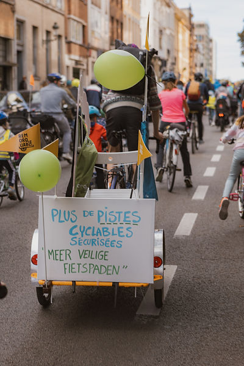
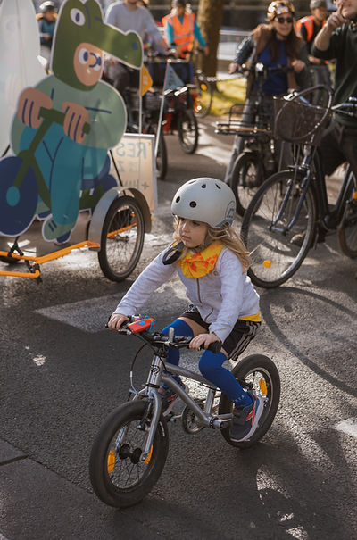

top of page

Skip to Main Content

###### Nos Recommandations 

Quelques recommandations que nous souhaitons promouvoir pour une ville cyclable à taille d’enfant :

​​​

###### 1\. Pistes cyclables sur les grands axes

  
● Aménagez des pistes cyclables larges et physiquement séparées sur les grands axes fréquentés, afin de permettre aux familles de circuler à vélo en toute sécurité.  
● Assurez des itinéraires cyclables continus, sans interruptions soudaines ni traversées dangereuses, en particulier sur les trajets vers les écoles ou les zones de loisirs.

​

###### 2\. Parking vélo pour les familles

  
● Créez des stationnements vélos suffisants et accessibles en tenant compte des vélos cargos et des vélos pour enfants.  
● Prévoyez des abris à vélos couverts et bien éclairés pour rendre leur usage plus attrayant et plus sûr.

​

###### 3\. Environnement scolaire sécurisé

  
● Mettez en place des rues scolaires pendant les heures d’entrée et de sortie, avec encadrement et communication claire aux parents.  
● Securisées les abords des écoles avec une signalisation claire, des dispositifs de ralentissement et des passages piétons sécurisés.  
● Encouragez les déplacements actifs (à pied ou à vélo) via des systèmes de récompense ou des campagnes, en collaboration avec les écoles.

​

###### 4\. Application de la zone 30

  
● Renforcez le contrôle dans les zones limitées à 30 km/h, via des contrôles ou l’utilisation de radars avec affichage de la vitesse.  
● Adaptez l’infrastructure pour que la réduction de vitesse se fasse naturellement, avec des rétrécissements, des ralentisseurs ou des carrefours surélevés.  
● Sensibilisez les conducteurs à l’importance de rouler lentement dans les quartiers résidentiels et autour des écoles, par le biais de campagnes ou d’initiatives de quartier.

​

Continuer à lire :

[Mission de base - Basis missie](https://www.kidicalmass.be/le-projet-het-project)

[Manifeste Ville Aux Enfants](https://www.kidicalmass.be/what-we-want)

###### Beleidsaanbevelingen 

###### ​

Enkele aanbevelingen die we graag uitdragen voor een fietsstad op kindermaat​. 

​​

###### 1\. Fietspaden op de grote assen 

● Leg brede, fysiek afgescheiden fietspaden aan op drukke hoofdassen om gezinnen met kinderen veilig te laten fietsen. 

● Zorg voor continue fietsroutes zonder plotse onderbrekingen of gevaarlijke oversteken, zeker op trajecten naar scholen of recreatiezones. 

​

###### 2\. Fietsparking voor families 

● Creëer voldoende en toegankelijke fietsstallingen met aandacht voor bakfietsen en kinderfietsen. 

● Voorzie overdekte en goed verlichte fietsenstallingen om het gebruik aantrekkelijker en veiliger te maken. ​

​

###### 3\. Veilige schoolomgeving 

● Voer schoolstraten in tijdens begin- en einduren, met begeleiding en duidelijke communicatie naar ouders. 

● Maak schoolomgevingen autoluw en overzichtelijk, met duidelijke signalisatie, snelheidsremmers en veilige oversteekplaatsen. 

● Stimuleer actieve verplaatsingen (te voet of met de fiets) via beloningssystemen of campagnes, in samenwerking met scholen. 

###### 4\. Handhaving zone 30 

● Verhoog de handhaving in 30 km/u-zones, via controles of inzet van snelheidsmeters met feedback. 

● Pas infrastructuur aan om de snelheid vanzelf te verlagen, zoals versmallingen, drempels of verhoogde kruispunten. 

● Sensibiliseer bestuurders over het belang van traag rijden in woon- en schoolomgevingen, via campagnes of buurtinitiatieven. 

​​

Lees verder: 

[Het project - Basis missie](https://www.kidicalmass.be/le-projet-het-project)

[Manifesto Stad op Kindermaat](https://www.kidicalmass.be/what-we-want)

​

bottom of page
