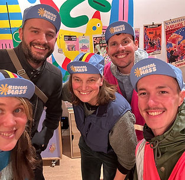
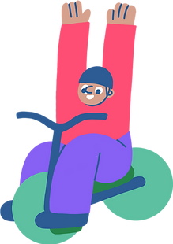
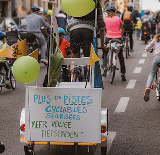
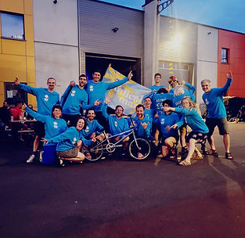
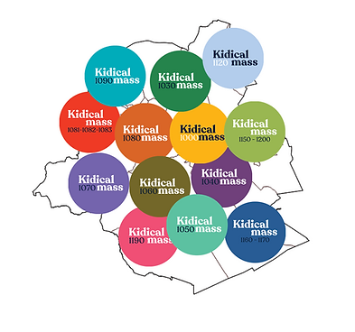
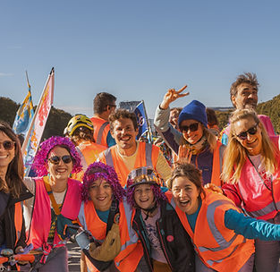
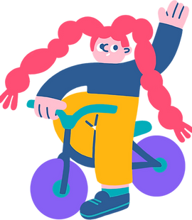
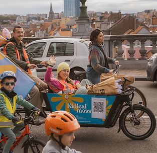
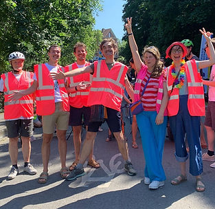
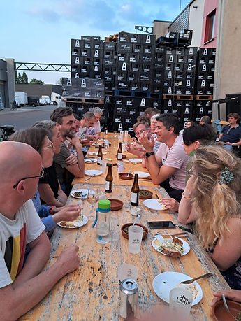

top of page

Skip to Main Content

###### Comment s’organise la famille Kidical Mass ? 

Kidical Mass est un mouvement mondial pour se réapproprier l'espace routier avec des démonstrations cyclistes joyeuse et colorées. Le format est axé sur les enfants et la mobilité douce. Pour encourager davantage d'enfants à utiliser le vélo de manière sécurisée et agréable, nous avons établi un ensemble un cadre de fonctionnement et de bonne pratique. Notre objectif est de créer une base bienveillante et solidaire qui permet aux jeunes cyclistes de découvrir leur environnement tout en apprenant le code de la route. À travers les Kidical Mass nous visons à promouvoir la mobilité douce et à renforcer la communauté cycliste locale. 

Meetups régionaux

En 2020 Kidical Mass Brussels est née et compte maintenant plus de 12 groupes dans 16 communes Bruxelloises. Quatre fois par an, nous organisons ensemble des rencontres Kidical où plus de 100 bénévoles enthousiastes sont invités. Ensemble nous avons crée un cadre de fonctionnement pour les kidical mass à Bruxelles. 

C’est ici que nos décisions importantes sont prises et validé par les représentants de chaque groupe local. Chacun.e  peut proposer des sujets à l'ordre du jour. Ces rencontres sont destinées à échanger des connaissances et des bonnes pratiques, à discuter des idées d'amélioration et surtout à passer un bon moment ensemble. Entre les réunions, nous restons en contact via un groupe WhatsApp général comprenant tous les coordinateurs locaux ainsi que des (13) groupes WhatsApp locaux pour chaque commune.

Duo de Coordination

Notre duo de coordination est disponible en tant que point de contact central pour le soutien pratique des groupes locaux et des bénévoles. Ils aident à lancer de nouveaux groupes en fournissant du coaching, de la motivation et du soutien en matière de communication. De plus, ils s'occupent de notre communication générale via les réseaux sociaux et les contacts avec la presse. Ils conçoivent tout le matériel Kidical, des flyers aux gilets. Ils organisent des formations pour un accompagnement sécurisé, résolvent les problèmes quotidiens et veillent à la qualité et sécurité de base. En outre, ils fournissent un soutien aux groupes débutants en matière de contact avec les partenaires régionaux, pouvoir publics et les brigades cyclistes, et veillent au bon fonctionnement de l'organisation sur le plan financier, y compris les demandes de subventions pour l’entièreté de l’organisation. 

Parcours & Sécurité

Pour chacque Kidical Mass , nous créons un nouveau parcours pour que les enfants puissent découvrir de nouveaux endroits dans leur commune. Les itinéraires passent par des terrains de jeux, des écoles, des parcs et de nouvelles infrastructures cyclables, et parfois par des événements locaux. Nos sorties sont inclusives pour les cyclistes débutants (environ 3 à 12 ans) et durent au maximum une heure sur une distance de 5 à 7 km. Chaque Kidical commence par une introduction aux règles de circulation et se termine par une photo de groupe. Les parents restent responsables de la sécurité de leurs enfants.

Pour garantir une expérience cycliste agréable, nous évitons les points de congestion et les situations dangereuses. Il y a au minimum un accompagnateur en gilet rose pour dix participants, avec un minimum de quatre accompagnateurs par Kidical. Au début de la saison, nous proposons une formation pour créer et suivre des itinéraires sur Komoot et une formation pour les accompagnateurs.

​

Il ne faut pas hésiter à demander de l'aide pour mieux préparer ou sécuriser une sortie. Nous sommes toute une communauté de cyclistes expérimentés qui peuvent donner de précieux conseils.

Groupes locaux

Nous sommes maintenant actif dans 16 des 19 communes Bruxelloises. En 2024 nous avons mobilisé pres de 5500 participants. N’hésite pas à rejoindre ou participer à une des 60 parades kidical près de chez toi! Plus d’info par : [contact@kidicalmass.brussels](mailto:contact@kidicalmass.brussels) 

​

\_\_\_

De bonnes règles de base sont importantes pour garantir que tous les participants (enfants et parents) se sentent en sécurité et à l'aise pendant les événements Kidical Mass. Elles aident également à assurer le bon déroulement de l'organisation et à renforcer la communauté en offrant clarté et cohérence.

###### Hoe is de familie Kidical Mass georganiseerd?

Kidical Mass is een wereldwijde beweging voor kinder- en  fietsvriendelijke steden. Om meer kinderen te stimuleren op een veilige en plezierige manier de fiets te gebruiken, hebben we een set van regels en goede praktijken opgesteld. Ons doel is om een zorgzame en ondersteunende basis te creëren die jonge fietsers in staat stelt hun omgeving te ontdekken terwijl ze de verkeersregels leren. Via Kidical Mass streven we ernaar zachte mobiliteit te bevorderen en de lokale fietsgemeenschap te versterken.

gewestelijke Meetups

Kidical Mass Brussels ontstond in 2020 en telt nu meer dan 12 groepen in 16 Brusselse gemeenten. Vier keer per jaar organiseren we Kidical bijeenkomsten waar meer dan 100 enthousiaste vrijwilligers worden uitgenodigd. Samen hebben we een kader gecreëerd voor de Kidical Mis in Brussel. Hier worden onze belangrijke beslissingen genomen. Iedereen kan onderwerpen op de agenda zetten. Deze bijeenkomsten zijn bedoeld om kennis en goede praktijken uit te wisselen, ideeën voor verbetering te bespreken en vooral om een goede tijd samen door te brengen. Tussen de bijeenkomsten door blijven we in contact via een algemene WhatsApp-groep met alle lokale coördinatoren en via 13 lokale WhatsApp-groepen voor elke gemeente.

Coördinatieduo

Ons coördinatieduo is beschikbaar als centraal aanspreekpunt voor praktische ondersteuning van lokale groepen en vrijwilligers. Zij helpen nieuwe groepen op te zetten door coaching, motivatie en ondersteuning bij communicatie te bieden. Ze zorgen wekelijks voor coherente communicatie via sociale media, website en drukwerk. Ze ontwerpen al het Kidical-materiaal, van flyers tot hesjes. Ze zijn ook het aanspreekpunt voor de pers. Ze organiseren trainingen voor veilige begeleiding, lossen dagelijkse problemen op en zorgen voor de basiskwaliteit en -veiligheid. Daarnaast ondersteunen ze beginnende groepen bij contacten met regionale partners, overheidsinstanties en fietsbrigades, en zorgen ze voor de goede werking van de organisatie op financieel gebied, inclusief subsidieverzoeken voor de gehele organisatie. 

Routes & Veiligheid

Voor elke Kidical Mass creëren we een nieuwe route zodat de kinderen nieuwe plekken in hun gemeente kunnen ontdekken. De routes voeren langs speeltuinen, scholen, parken en nieuwe fietsinfrastructuur, en soms langs lokale evenementen. Onze ritten zijn inclusief voor beginnende fietsers (ongeveer 4 tot 10 jaar) en duren maximaal een uur over een afstand van 5 tot 7 km. Elke Kidical begint met een introductie over verkeersregels en eindigt met een groepsfoto. Ouders blijven verantwoordelijk voor de veiligheid van hun kinderen.

Om een aangename fietservaring te garanderen, vermijden we knelpunten en gevaarlijke situaties. Er is minimaal één begeleider in een roze hesje per tien deelnemers, met een minimum van vier begeleiders per Kidical. Aan het begin van het seizoen bieden we een training voor het opmaken en volgen van een Komoot Parcours en een training voor begeleiders aan.

​

​Aarzel niet om hulp te vragen om een tocht beter voor te bereiden of veiliger te maken. Wij zijn een hele gemeenschap van ervaren fietsers die waardevolle adviezen kunnen geven.

Lokale groepen

We zijn nu actief in 16 van de 19 Brusselse gemeenten. In 2024 hebben we bijna 5500 deelnemers gemobiliseerd. Aarzel niet om mee te doen of deel te nemen aan een van de 60 Kidical-parades bij jou in de buurt! Meer info via: [contact@kidicalmass.brussels](mailto:contact@kidicalmass.brussels).  
 

\_\_\_

Goede afspraken zijn belangrijk om ervoor te zorgen dat alle deelnemers (ouders en kinderen) zich veilig en comfortabel voelen tijdens de Kidical Mass-evenementen. Ze helpen ook bij het soepel verlopen van de organisatie en het versterken van de gemeenschap door duidelijkheid en consistentie te bieden.

###### Organigram

###### Team communication & coordination    
Coordinatie en communicatie team

###### Porteurs locaux - Lokale trekkers  
4 Meetup / ans - jaar

###### Comité de fête - Feestcomité

###### 14 groupes - 14 groepen  
 

###### Groupes de travail thématique  
Thematische werkgroepen

bottom of page
