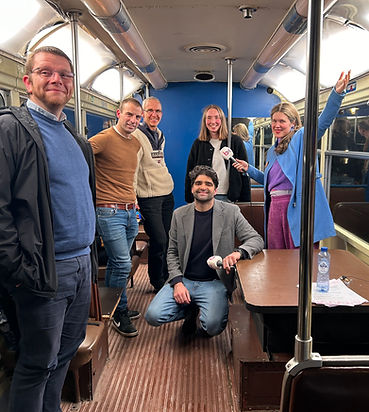
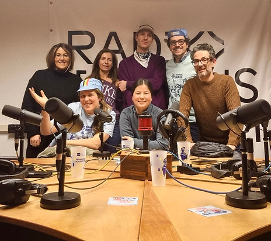
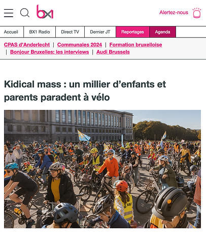
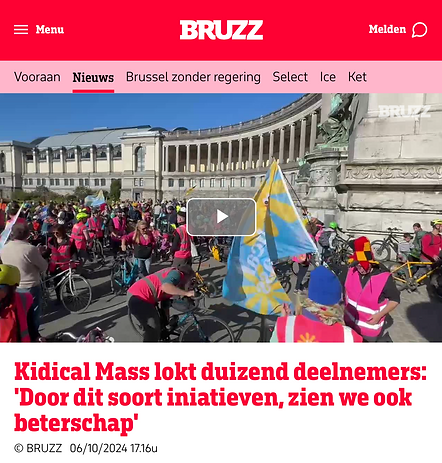

top of page

Skip to Main Content

2025

​

RTBF - 21 juin 2025

[“Kidical mass” : des enfants dans la rue pour demander plus de sécurité lors de leurs déplacements à vélo](https://www.rtbf.be/article/kidical-mass-des-enfants-dans-la-rue-pour-demander-plus-de-securite-lors-de-leurs-deplacements-a-velo-11565713?utm_source=bskyrtbfinfo&fbclid=IwY2xjawLF9nBleHRuA2FlbQIxMQBicmlkETBObEZMd1BNWXNhakNyY2VqAR6QMSFmOeeMIdoZcyDsqYR9aDX3Rg68FbxO3AFUY-11spWPi9s9HlCxfi6K-A_aem_JZwImzN8PJ_F1tjh7Ltc8g) -

​

13 mai - Vivavité

Kidical Mass et Morning rush le vélo à l'honneur a namur

[https://www.rtbf.be/article/morning-rush-et-kidicall-mass-le-velo-a-l-honneur-a-namur-ce-samedi-11562950](https://www.rtbf.be/article/morning-rush-et-kidicall-mass-le-velo-a-l-honneur-a-namur-ce-samedi-11562950)

​

5 mei - Het Laatste Nieuws

Vijf jaar Kidical Mass: feest en fietsprotest voor een kindvriendelijke stad

[https://www.hln.be/brussel/vijf-jaar-kidical-mass-feest-en-fietsprotest-voor-een-kindvriendelijke-stad~a4a43002/](https://www.hln.be/brussel/vijf-jaar-kidical-mass-feest-en-fietsprotest-voor-een-kindvriendelijke-stad~a4a43002/)

​​

4 mei - Bruzz TV (video)

Kidical mass bepleit fietsvriendelijk brussel voor jongeren 

[https://www.bruzz.be/actua/veiligheid/kidical-mass-bepleit-fietsvriendelijk-brussel-voor-jongeren-2025-05-04](https://www.bruzz.be/actua/veiligheid/kidical-mass-bepleit-fietsvriendelijk-brussel-voor-jongeren-2025-05-04)

​

21 février - BX1

Le Tram – La mobilité des jeunes (video)

[https://bx1.be/emission/le-tram-la-mobilite-des-jeunes/](https://bx1.be/emission/le-tram-la-mobilite-des-jeunes/?theme=classic)

​2024​​

​​

14 octobre - BX1

Kidical mass : un millier d’enfants et parents paradent à vélo

[https://bx1.be/categories/mobilite/kidical-mass-un-millier-denfants-et-parents-paradent-a-velo/?theme=classic](https://bx1.be/categories/mobilite/kidical-mass-un-millier-denfants-et-parents-paradent-a-velo/?theme=classic)

​

7 oktober/octobre 2024

Kidical Mass mobilise près de 1 150 parents et enfants pour revendiquer une ville plus adaptée aux enfants

[Communiqué revendications Grande Kidical Mass 2024](https://www.kidicalmass.be/_files/ugd/cf0153_93a3decd79b74d1595233c7f93464dc3.pdf)

Kidical Mass mobiliseert bijna 1.150 ouders en kinderen om een fiets en kindvriendelijkere stad te eisen

[Persbericht eisen Grote Kidical Mass 2024](https://www.kidicalmass.be/_files/ugd/cf0153_72d2f4caec3f461cb95a5526d0a4730e.pdf)

​​​​

6 oktober 2024 - Bruzz  

“Kidical Mass lokt duizend deelnemers: 'Door dit soort iniatieven, zien we ook beterschap'”

[https://www.bruzz.be/actua/mobiliteit/grote-opkomst-voor-jaarlijkse-grote-kidical-mass-2024-10-06](https://www.bruzz.be/actua/mobiliteit/grote-opkomst-voor-jaarlijkse-grote-kidical-mass-2024-10-06)

​

3 octobre 2024 - BX1

Tous les jours de 14h à 15h, Amélie Bondjutu vous emmène à la découverte de Bruxelles. Aujourd’hui, elle participe à Kidical Mass, une parade cycliste festive pour les enfants.

[https://bx1.be/radio-emission/bruxelles-vit-kidical-mass-03-10-2024/](http://bx1.be/radio-emission/bruxelles-vit-kidical-mass-03-10-2024/)

​

5 maart 2024 - Het Laatste Nieuws  [Traduction FR](https://www.kidicalmass.be/interview-fr)  

“Dit jaar organiseren we 60 fietstochten doorheen Brussel”

[https://www.hln.be/brussel/leticia-37-bouwt-aan-een-fietscultuur-in-brussel-met-kidical-mass-dit-jaar-organiseren-we-60-fietstochten-doorheen-brussel~a2dc9830/](https://www.hln.be/brussel/leticia-37-bouwt-aan-een-fietscultuur-in-brussel-met-kidical-mass-dit-jaar-organiseren-we-60-fietstochten-doorheen-brussel~a2dc9830/)     ​​​​​​​​​​​​​

​​​

20 février 2024

[Persbericht Start seizoen 2024](https://www.kidicalmass.be/_files/ugd/cf0153_a54cf90c103a4a66a1ba730048dcc473.pdf) 

[Communiqué début Kidical 2024](https://www.kidicalmass.be/_files/ugd/cf0153_83ec298a98d74fd08d835a0843f0bed9.pdf)

​

2023

  
10 september 2023 - Het Laatste Nieuws

Driejarig bestaan Kidical Mass gevierd met tocht door Brussel  
[https://www.hln.be/brussel/driejarig-bestaan-kidical-mass-gevierd-met-tocht-door-brussel~a0badfe0/?fbclid=IwAR2Q0-AZPCEMIGhZoYkga0eohvvy7\_wVKR7a4ky48YqAB3VIyTZbRTvbuyQ&referrer=https%3A%2F%2Fl.facebook.com%2F](https://www.hln.be/brussel/driejarig-bestaan-kidical-mass-gevierd-met-tocht-door-brussel~a0badfe0/?fbclid=IwAR2Q0-AZPCEMIGhZoYkga0eohvvy7_wVKR7a4ky48YqAB3VIyTZbRTvbuyQ&referrer=https%3A%2F%2Fl.facebook.com%2F)  
  
10 september 2023 - BX1

Kidical Mass : plus de sécurité pour les enfants à vélo  
[https://bx1.be/categories/news/kidical-mass-plus-de-securite-pour-les-enfants-a-velo/?fbclid=IwAR0NPJ6jSxzlH\_Kvb5Gf-5ydaSzRtBI0KzO4Kqh5J6zHwdSZXSXSP8xOUlg](https://bx1.be/categories/news/kidical-mass-plus-de-securite-pour-les-enfants-a-velo/?fbclid=IwAR0NPJ6jSxzlH_Kvb5Gf-5ydaSzRtBI0KzO4Kqh5J6zHwdSZXSXSP8xOUlg)

  
11 september 2023 - La Derniere Heure

Près d’un millier de participants à la "Kidical Mass" organisée à Bruxelles ce dimanche  
[https://www.dhnet.be/regions/bruxelles/bruxelles-mobilite/2023/09/11/pres-dun-millier-de-participants-a-la-kidical-mass-organisee-a-bruxelles-ce-dimanche-YIPY45NFIVEBDES67UI2FJTXQI/?fbclid=IwAR2W6gI4o7c-eR1lgo1BOFualuNkko\_6E3EvTCmlEkePV0-PimadnbnhBmA](https://www.dhnet.be/regions/bruxelles/bruxelles-mobilite/2023/09/11/pres-dun-millier-de-participants-a-la-kidical-mass-organisee-a-bruxelles-ce-dimanche-YIPY45NFIVEBDES67UI2FJTXQI/?fbclid=IwAR2W6gI4o7c-eR1lgo1BOFualuNkko_6E3EvTCmlEkePV0-PimadnbnhBmA)

11 september 2023 Het Nieuwsblad 

Kidical Mass lokt bijna 1.000 deelnemers  
[https://www.nieuwsblad.be/cnt/dmf20230911\_93580288?fbclid=IwAR0R89daQax06HEh7Oimd0k32MBEfH48Pa7hvIl-CCOOuuGwPFoO4ovOaz4](https://www.nieuwsblad.be/cnt/dmf20230911_93580288?fbclid=IwAR0R89daQax06HEh7Oimd0k32MBEfH48Pa7hvIl-CCOOuuGwPFoO4ovOaz4)

2 November 2023 - Politico  

Living Cities: Turning Helsinki’s empty offices into homes  
[https://www.politico.eu/newsletter/global-policy-lab/living-cities-turning-helsinkis-empty-offices-into-homes/?fbclid=IwAR2W6gI4o7c-eR1lgo1BOFualuNkko\_6E3EvTCmlEkePV0-PimadnbnhBmA](https://www.politico.eu/newsletter/global-policy-lab/living-cities-turning-helsinkis-empty-offices-into-homes/?fbclid=IwAR2W6gI4o7c-eR1lgo1BOFualuNkko_6E3EvTCmlEkePV0-PimadnbnhBmA)

  
7 december 2023 - Bruzz 

Fietsambassadeur Leticia Sere bij Melina: 'Er is nood aan conflictvrije kruispunten'  
[https://www.bruzz.be/videoreeks/melina/video-leticia-sere-bij-melina-er-nood-aan-conflictvrije-kruispunten](https://www.bruzz.be/videoreeks/melina/video-leticia-sere-bij-melina-er-nood-aan-conflictvrije-kruispunten)

7 september 2023 - Bruzz 

Leticia Sere (Kidical Mass): ‘Liever Schaarbike dan Carbeek'

[https://www.bruzz.be/mobiliteit/leticia-sere-kidical-mass-kinderen-kunnen-zoveel-bijdragen-aan-verkeersveiligheid-2023](https://www.bruzz.be/mobiliteit/leticia-sere-kidical-mass-kinderen-kunnen-zoveel-bijdragen-aan-verkeersveiligheid-2023)

​

2022

​

Kidical Mass : la manifestation à vélo s’adapte aux enfants

[https://bx1.be/categories/news/kidical-mass-la-manifesttion-a-velo-sadapte-aux-enfants/](https://bx1.be/categories/news/kidical-mass-la-manifesttion-a-velo-sadapte-aux-enfants/)

​

Kidical Mass in Elsene: “Willen kinderen leren fietsen op laagdrempelige manier”

[https://www.hln.be/brussel/kidical-mass-in-elsene-willen-kinderen-leren-fietsen-op-laagdrempelige-manier~a0cd3db6/](https://www.hln.be/brussel/kidical-mass-in-elsene-willen-kinderen-leren-fietsen-op-laagdrempelige-manier~a0cd3db6/)

​

Une "grande Kidical Mass" ce dimanche à Bruxelles au départ du Grand-Hospice  

[https://www.dhnet.be/regions/bruxelles/bruxelles-mobilite/2022/09/09/une-grande-kidical-mass-ce-dimanche-a-bruxelles-au-depart-du-grand-hospice-DM7FZ2QGXFBKFKAROND3OCU2JQ/](https://www.dhnet.be/regions/bruxelles/bruxelles-mobilite/2022/09/09/une-grande-kidical-mass-ce-dimanche-a-bruxelles-au-depart-du-grand-hospice-DM7FZ2QGXFBKFKAROND3OCU2JQ/)

​

###### 2020

###### ​

Eerste Kidical Mass is schot in de roos

[https://www.nieuwsblad.be/cnt/dmf20200701\_93495053](https://www.nieuwsblad.be/cnt/dmf20200701_93495053)

​

[Kidical Mass: 'Fietsen moet vanzelfsprekend worden'](https://www.bruzz.be/videoreeks/vrijdag-26-juni-2020/video-kidical-mass-fietsen-moet-vanzelfsprekend-worden)

[https://www.bruzz.be/videoreeks/vrijdag-26-juni-2020/video-kidical-mass-fietsen-moet-vanzelfsprekend-worden](https://www.bruzz.be/videoreeks/vrijdag-26-juni-2020/video-kidical-mass-fietsen-moet-vanzelfsprekend-worden)

bottom of page
