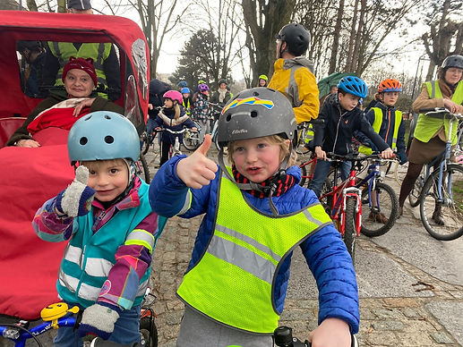
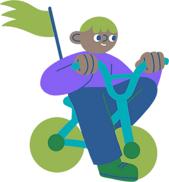

top of page

Skip to Main Content

###### Bruxelles aux Enfants : Manifeste pour une ville enfants bienvenu·es ! 

###### À l'occasion de la journée internationale de la protection des droits des enfants, une coalition d'associations revendique une ville à hauteurs d'enfants, respectueuse de leurs droits.

« Un beau souvenir de mon enfance, c’est quand on jouait dehors. J’étais dehors sur un arbre qui était tombé. On était dessus au moins à dix gosses, on était dessus assis comme ça.  Alors on se balançait toute la journée, et ooooooh ! Et on chantait toute la journée... Avec tous les enfants du quartier. »,  Julienne, maman de deux enfants de 2 et 5 ans\* 

Des enfants qui jouent à côté de leur maison dans une plaine de jeux, d’autres qui se rendent à l’école seul·es sans que leurs parents s’inquiètent, des adolescentes qui s’arrêtent dans un espace vert sur le chemin du retour à la maison sans crainte d'être harcelées, pouvoir se soulager dans des toilettes publiques plutôt que se cacher derrière des buissons, faire du vélo plus souvent que seulement durant la journée sans voiture... Voilà la ville dont beaucoup rêvent pour leurs enfants. Un rêve bien loin de la réalité! Malgré sa vitalité et sa jeunesse, Bruxelles n’offre pas un environnement urbain sain, respectueux des droits des enfants.  Et pourtant 22% de la population bruxelloise a moins de 18 ans. 

​

​

​

​

​

​

​

​

​

​

​

​

​

​

​

​

​

« J’ai trois enfants, dont un encore en poussette, mais je n’ai que deux mains. C’est difficile de les garder près de moi. J’ai constamment peur des voitures, des trams... le temps de rentrer de l’école, je suis épuisée, je préfère rentrer chez moi plutôt que de passer par le parc. » Fatima, mère de trois enfants, Jette.

 Les professionnel·les du secteur de l'enfance le constatent,  les enfants et les jeunes passent de moins en moins de temps à l'extérieur, ce qui entraîne des conséquences néfastes diverses : délitement des liens sociaux, lourds problèmes de santé physique et mentale liées à la sédentarité, à la pollution de l'air et à l'augmentation du stress, non apprentissage des risques, manque de confiance en soi .... 

« J’ai l’impression que je passe mon temps à couper l’élan de vie de mes enfants - à leur gueuler ‘ne courez pas ! Restez près de moi ! Stop !’ C’est fatigant et déplaisant. » Camille, mère de deux enfants, Saint-Gilles.

Plusieurs raisons expliquent pourquoi les enfants et les jeunes deviennent de plus en plus casanier·es. En premier lieu, le sentiment d’insécurité sur les routes. En effet, la circulation routière constitue une des raisons principales de la diminution du temps passé par les enfants à l’extérieur et de la perte de leur autonomie. Dans les quartiers denses, les familles sont peu nombreuses à posséder une voiture. L’automobile prend néanmoins une place prépondérante et entre directement en compétition avec les enfants dans l’espace public. C'est le plus souvent dans ces mêmes quartiers que l'on observe  une [qualité de l'air médiocre voire mauvaise](https://curieuzenair.brussels/fr/les-resultats/)  ainsi qu'un manque de lieux extérieurs privatifs (balcon, cour ou jardin), [d'espaces publics de qualité](https://bxl-malade.medor.coop/?lang=fr), et notamment [d'étendues vertes attrayante](https://isglobalranking.org/city/brussels/#green)s pour les enfants et les familles. On le constate donc, l'inadéquation et l'insuffisance de l'espace public à Bruxelles créent des problèmes qui coûtent à la société, particulièrement pour les familles bruxelloises les plus vulnérables socioéconomiquement.

Ces constats vont à l'encontre des droits de l'enfant (particulièrement les articles 6, 12, 13,24 & 31), dont la Convention Internationale a été signée et ratifiée par la Belgique. Or, ces problèmes pourraient être réduits ou même supprimés. La situation actuelle n’est en rien une fatalité, mais une question de choix politiques. Il est de la responsabilité des gouvernements de garantir le droit des enfants à un environnement sain et sûr. Les candidat·es aux prochaines élections 2024 doivent s’engager à prendre des mesures concrètes aux niveaux régional et communal et d'adopter ainsi une posture politique forte en faveur des enfants et des jeunes dans la ville. 

La ville aux enfants : rendre effectif le droit des enfants à la santé, à la sécurité, et à la participation

Nous, associations de différents secteurs et citoyen·nes, enjoignons les autorités publiques à s’atteler à : 

-   améliorer l'existant, multiplier et adapter les espaces verts et l’espace public aux besoins des familles, en priorité dans les quartiers en carence, et en remédiant à la trop faible présence des femmes et des filles;
    
-   développer des infrastructures sécurisantes, agréables et accessibles favorisant une mobilité autonome des enfants et des jeunes et encourageant les déplacements à pied, en poussette, à vélo;
    
-   réduire l’exposition des enfants aux différentes sources de dangers (notamment liés au trafic automobile et à la pollution atmosphérique); 
    
-   intégrer la participation des enfants et des jeunes aux projets d'aménagement de l'espace public.
    
-   L’espace public, s'il est accessible et de qualité, est un levier important pour améliorer la santé, la qualité de vie, le vivre ensemble. Les personnes vulnérables se sentent plus en sécurité avec la présence des familles, créant ainsi un cercle vertueux.  Une ville à taille d'enfant a donc des bénéfices tant au niveau individuel que collectif et sociétal, car elle devient accueillante pour tout le monde.C’est pourquoi nous, associations, avons rassemblé en vue des élections nos propositions en faveur d’une ville qui place les enfants et les jeunes en son cœur.  Investir pour l’avenir de nos enfants et de nos jeunes, dans des rues sûres, résilientes aux enjeux sanitaires et climatiques: c’est l’objet de notre [manifeste](https://cloud.heroesforzero.be/s/pWHNx9aiJ4A2x2Z).
    

«Ce qui lui plaît à vélo, je pense que c’est cette liberté d’être dehors, d’avoir de l’air, de partir tout seul. Je lui dis de circuler dans la cour mais il ne veut pas. Il veut toujours aller loin, sur la route. Je pense que c’est cette idée d’aller loin, de découvrir autre chose. »  Julienne, maman de deux enfants de 2 et 5 ans\* \*témoignages extraits de l’[étude RIEPP](https://riepp.be/wp-content/uploads/2022/11/Etude-RIEPP-2021-IEE-enquete-parents-DEF.pdf) 2021.

Manifeste complet

[

05-2024\_Manifeste pour une ville enfant\_A4\_v4.pdf](https://www.kidicalmass.be/_files/ugd/cf0153_2b074cb919ea46698c1732a2f55b26eb.pdf "05-2024_Manifeste pour une ville enfant_A4_v4.pdf")

bottom of page
