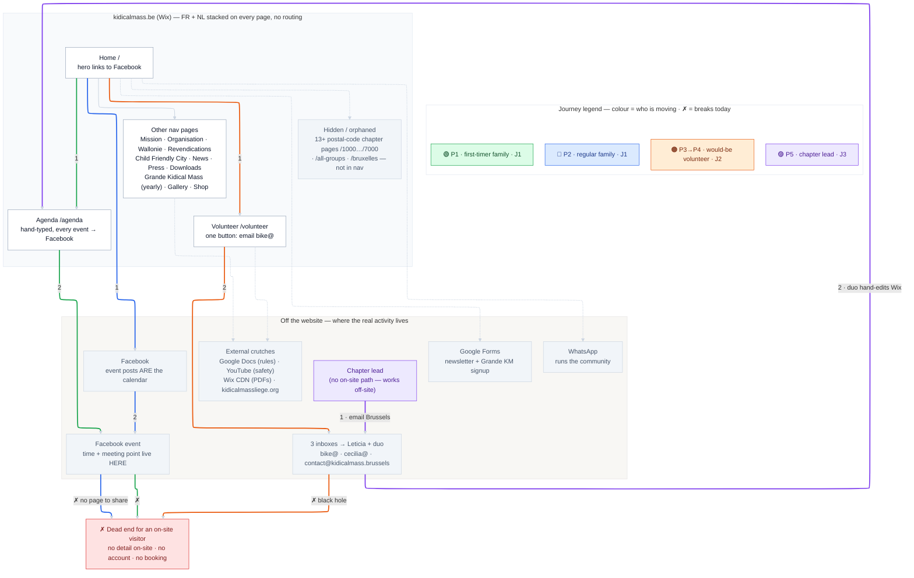

# Sitemap — AS-IS (current Wix site)

The structure of **kidicalmass.be as it is today**, with each persona's attempted route drawn in its [signature colour](journey-palette.md) — the same four colours as the to-be maps and the A5 cards. Compare against the to-be sitemaps: [Public](22-sitemap-to-be-public.md) · [Private](23-sitemap-to-be-private.md). Sourced from the [Site Audit](../site-audit.md) and the URL inventory in the [Redirect Map](26-redirect-map.md).

**The one-line story:** the website is not the entry point — **Facebook is**. Every coloured route bends out of the site: families bounce to Facebook and hit a dead end, would-be volunteers fall into the email black hole, and a chapter lead has *no on-site path at all* — they email Brussels and the duo hand-edit Wix. No logged-in zone, no self-publishing, no structured data.

## Legend

🟢 **P1 first-timer family** · 🔵 **P2 regular family** · 🟠 **P3→P4 would-be volunteer** · 🟣 **P5 chapter lead** — colour = *who is moving*; the number is that journey's step; **✗** marks where it dies today. Full token values: [journey-palette.md](journey-palette.md).

## Where each route breaks today

- **🟢 P1 first-timer family (J1):** Home → **Agenda** (a text-only date list, no times or locations) → bounces to **Facebook** → **dead end** for anyone without a Facebook account.
- **🔵 P2 regular family (J1):** knows the drill, jumps to **Facebook** for the next date — but there is **no standalone event page** to share; the site offers nothing to link to.
- **🟠 P3→P4 would-be volunteer (J2):** Home → **Volunteer** → one button, "email `bike@`". No form, no role, no chapter routing → the **email black hole**.
- **🟣 P5 chapter lead (J3):** has **no on-site path**. They email Brussels and wait; the coordination duo hand-edit the Wix agenda. The calendar is a single point of failure.

## The seven cross-cutting problems (from the audit)

1. **Bilingual structure is broken** — FR and NL stacked on every page; no toggle, no `/fr` `/nl` routes.
2. **Total Facebook dependency** — the entire event ecosystem lives on Facebook.
3. **Everything is manual** — no database-driven content anywhere.
4. **No chapter pages exist** — 13+ active local groups, not one has a real page.
5. **Contact fragmentation** — three inconsistent email addresses (`.be` vs `.brussels`).
6. **No structured volunteer onboarding** — read page → send email → wait.
7. **Stats and content go stale immediately** — hardcoded 2024 numbers shown in 2026.

## Uncertainty flags

- Only **Namur (`/5000`)** and **Mons (`/7000`)** were captured with real content in the scrape; the Brussels postal pages exist (direct links, in the redirect map) but their on-site content is unverified and assumed agenda-thin.
- The current Wix **navigation order** is not formally documented; the page grouping here is reconstructed from the audit and arranged for comparison, not a pixel-exact nav.
