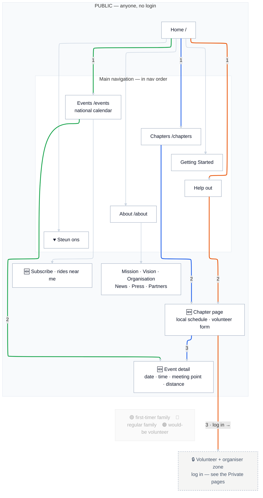

# Sitemap — TO-BE · Public pages

The **public** half of the new site — everything anyone can see without logging in. The login-gated half is on the next page: [TO-BE · Private zone](23-sitemap-to-be-private.md). Compare against [AS-IS](21-sitemap-as-is.md). Colours follow the [journey palette](journey-palette.md), shared with the A5 cards.

**Story:** the national site finally answers "when and where, near me" on-site. Top-level pages run in real nav order (Events leads). Footer/utility pages (Contact, Privacy, login link) are omitted here for clarity.

## Legend

🟢 **P1 first-timer family** · 🔵 **P2 regular family** · 🟠 **P3→P4 would-be volunteer** — colour = *who is moving*; the number is the step. 🟣 Chapter leads (P5) work in the [private zone](23-sitemap-to-be-private.md); the rides they publish appear automatically on **Events** and **Chapter pages**. 🆕 = new page.

## Reading the routes

- **🟢 P1 first-timer family:** Home → **Events** (filter by town) → **Event detail** (date, time, meeting point, distance). No Facebook.
- **🔵 P2 regular family:** Home → **their Chapter** → **Chapter page** → **Event detail** — a shareable page that isn't Facebook.
- **🟠 P3→P4 would-be volunteer:** Home → **Help out** → **Chapter page** (routed form to the local lead), then **log in** to continue in the [private zone](23-sitemap-to-be-private.md).

## The hub

**Events** is the national calendar: every chapter's rides aggregate here automatically. Chapter leads never email Brussels — they publish in the private zone and the ride surfaces on Events and on their Chapter page. Facebook stays for reach and points *into* the site.
