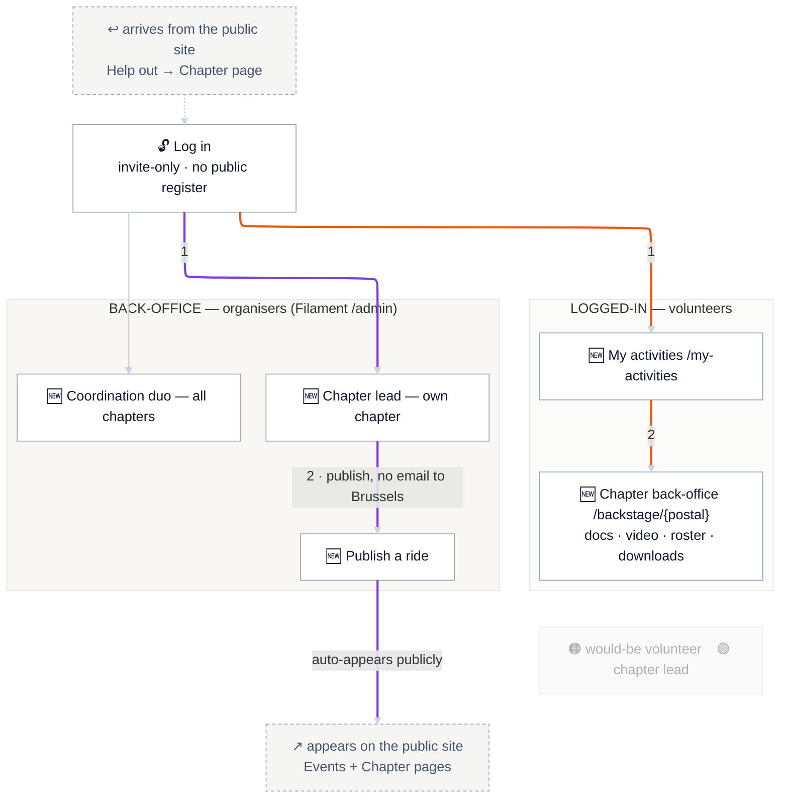

# Sitemap — TO-BE · Private zone

The **login-gated** half of the new site: the logged-in volunteer zone and the organiser back-office. The public half is the previous page: [TO-BE · Public](22-sitemap-to-be-public.md). Colours follow the [journey palette](journey-palette.md).

**Story:** families never come here — they stay on the public site. Accounts are invite-only (no public register). Volunteers get the material that lives in WhatsApp today; chapter leads publish rides that surface on the public site automatically.

## Legend

🟠 **P3→P4 volunteer** continues here after Help out · 🟣 **P5 chapter lead** publishes here. Number = step. 🆕 = new.

## Reading the routes

- **🟠 P3→P4 volunteer:** arrives from Help out on the public site → **log in** → **My activities** (their chapters' rides + meetups) → **Chapter back-office** (docs, video, roster, downloads — the material library that lives in WhatsApp today).
- **🟣 P5 chapter lead:** **log in** → **admin** (own chapter) → **Publish a ride**. One publish, no email to Brussels — it appears automatically on the public **Events** calendar and the **Chapter page**. *(This is the reframe D1; still the journey most at risk — untested, Alexandre is the planned interview.)*

## Out of scope here

Per the [strategy brief](../strategy/00-strategy-brief.md) and [D-1](01-concerns.md): no per-event attendance / "who's coming", no membership gate (viewing is public; login gates this zone only — D9), no Grande Kidical Mass cross-chapter coordination. The coordination duo (P6) has full cross-chapter admin access but no dedicated journey route.
